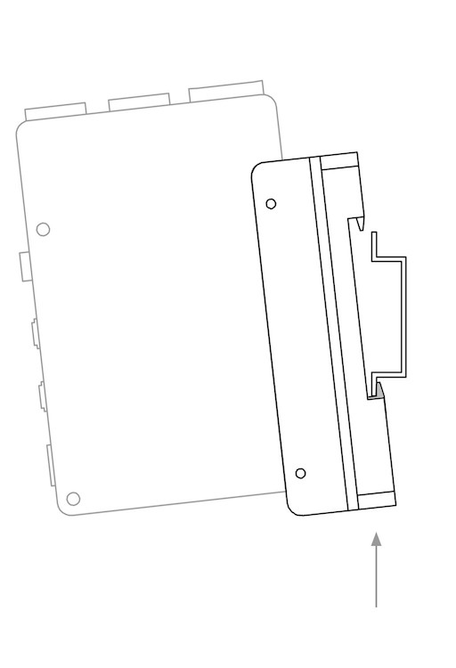

Sourcekit&reg; PiTray clip
===

Version: 1.0.0

Designer: Weihong Guan [](https://github.com/aguegu/) [](https://twitter.com/BG5USN), Guangcheng Zhan

# Description

Sourcekit&reg; PiTray clip is a Din Rail mounter for Single Board Computers like Raspberry Pi. Assembled of a 304 Stainless Steel blended plate and nylon clip with spring, it provides a simple, quick, strong and durable Din Rail installation solution suitable for industrial setup, home automation application as well as cluster building.

# Features

* Compatible with IEC/EN 60715 Din Rails
* 304 Stainless Steel PCB Rack with thickness of 1.5 mm
* Nylon (PA66 30GF) Clip with Spring, easy to mount and unmount
* Include 2 pcs of 304 Stainless Steel M2.5x4 blots to fasten PCB
* Brushed Polished Finish and free of rough edges
* Work for
  * Raspberry Pi 4B/3A+/3B+/3B/2B/1B+/1A/Zero W/Zero
  * PINE64 Rock64/PINE H64 Model B  
  * Hardkernel ODROID C4/C2/C1+
  * ASUS Tinker Board 2S/2/T/S  
  * Coral Dev Board
  * Sourcekit PiTray mini

# Instructions

1. Mount the lower jaw to the Din rail

2. Push up to compress the clip spring to make room for the upper jaw

3. While hoding the up pushing, let the upper jaw mount the Din rail

4. Release the clip spring, so PiTray clip is solid mounted on the Din rail

# Gallery

*Raspberry Pi is a trademark of the Raspberry Pi Foundation*
