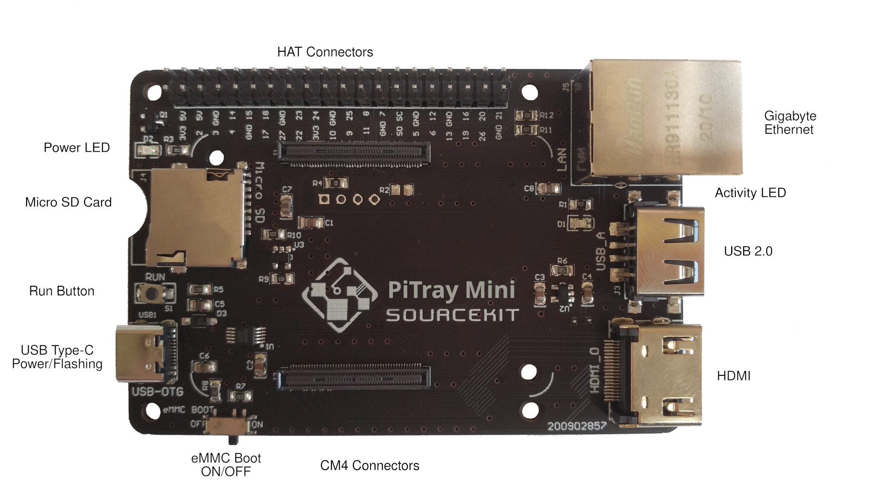

Sourcekit&reg; PiTray mini
===

Version: 1.1.0

Designer: Shenyuan Fang, Weihong Guan

# Overview

Sourcekit&reg; PiTray mini is a companion IO board for Raspberry Pi Compute Module (sold separately). It is designed for use both as a development system for Compute Module 4 (CM4) and as an embedded board integrated into end products.

It provides an excellent way to bring similar development experience of Raspberry Pi 4B to Compute Module 4. So users could upgrade their system or setup from the standard Raspberry Pi 4B to CM4 seamlessly. With capability to flash OS image to eMMC on CM4, PiTray mini serves as an budget lite alternative to [Raspberry Pi Compute Module 4 IO Board](https://www.raspberrypi.org/products/compute-module-4-io-board/).

# Layout



# Features

* Compatible with all variants of CM4, no matter whether it uses eMMC or micro SD card
* Capable to flash operation system image to eMMC on CM4 with regular approaches same as official CMIO board, no extra tools required
* Same dimensions and mounting holes compared to Model B Raspberry Pi, such as 3B/3B+/4B

# Specification

* 1 CM4 socket
* 1 set of standard Raspberry Pi HAT connectors
* 1 Standard HDMI 2.0 connector
* 1 Gigabit Ethernet RJ45 socket
* 1 native USB 2.0 connector
* 1 SD card socket for CM4 variants without eMMC
* 1 USB Type-C connector for powering and also programming eMMC variants of CM4
* 1 Boot Mode Switch for programming mode and normal mode
* 1 RUN botton for easy reset
* 1 Red Power LED
* 1 Green Activity LED
* 2 mounting holes for CM4
* 4 CM4 corner marks for CM4 position guidance

* Input power: +5V
* Dimensions: 85 mm x 56 mm
* [Mechanical Drawings](PiTray-mini-mech.pdf ':ignore')

# Get started

## CM4 without eMMC (Lite)

1. Got a micro SD card ready with operating system compatiable with raspberry pi, like NOOB, Raspbian or Ubuntu. (See also [1](https://www.raspberrypi.org/software/) [2](https://www.raspberrypi.org/software/operating-systems/) [3](https://www.raspberrypi.org/documentation/installation/installing-images/) [4](https://projects.raspberrypi.org/en/projects/raspberry-pi-setting-up))

2. Insert the Micro SD card into the micro SD socket on PiTray.

3. Make sure the `eMMC Boot` switch is at the `ON` position.

4. Mount the CM4 without eMMC on PiTray. *CAUTION: be careful of the CM4 position, align the CM4 layout corner marks and holes, otherwise CM4 or PiTray would get damaged*

5. Plug Other devices you may needed such as HDMI, Ethernet, USB (***see below***) Keyboard.

6. Power PiTray with a 15W USB-C power supply. With the power led on, you are good to go. Enjoy & have fun.

## CM4 with eMMC (Flashing Guide)

1. Unplug micro SD card from PiTray if any.

2. Mount the CM4 (with eMMC) on PiTray. *CAUTION: be careful of the CM4 position, align the CM4 layout corner marks and holes, otherwise CM4 or PiTray would get damaged*

3. Make sure the `eMMC Boot` switch is at the `OFF` position.

4. On PC, install and launch [raspberry pi usbboot](https://github.com/raspberrypi/usbboot). (See also: [5](https://www.raspberrypi.org/documentation/hardware/computemodule/cm-emmc-flashing.md))

5. Connect PiTray with USB Type-C cable to the PC.

6. Then an external disk like flash drive, aka USB mass storage, would show up on the PC, write this disk with OS image with Raspberry Pi Imager, Etcher or dd as the step 1 above.

7. After the image is written and the external drive is umounted from PC, disconnect PiTray from the PC.

8. Turn the `eMMC Boot` switch to `ON`.

9. Plug Other devices you may needed such as HDMI, Ethernet, USB (***see below***) Keyboard.

10. Power PiTray with a 15W USB-C power supply. With the red led on, you are good to go. Enjoy & have fun.

For CM4 with eMMC that already filled with OS image, just start from Step 8 for regular usage.

# Troubleshooting

* USB devices not working

> The USB interface is disabled to save power by default on the CM4. To enable it you need to add `dtoverlay=dwc2,dr_mode=host` to the config.txt file

As described in Section 4.2 on [Compute Module 4 datasheet](https://datasheets.raspberrypi.org/cm4/cm4-datasheet.pdf).

This `feature` could confuse whoever new to Raspberry Pi Compute Module 4, when the exact same behavior as regular Raspberry Pi Model A/B/Zero is expected, especially in case that a USB keyboard is the only approach to interact with the operating system.

To fix that, for CM4 without eMMc, power off CM4, unplug the micro SD card and mounted on a PC with Micro SD card Reader/Writer. Find `config.txt` file in the boot partition of the micro SD card, which looks like a flash drive. Append `config.txt` with the line

```
dtoverlay=dwc2,dr_mode=host
```

Save it, close the file, umount the micro SD card and mount it back to PiTray and try again.

For CM4 with eMMC, similar to the process to flash the operating system image, power off PiTray, switch off `eMMC Boot`, and connect PiTray to a PC with `usbboot` preloaded, then do the editing as above. Finally disconnect PiTray from PC then switch on `eMMC Boot` and try again.

For experienced raspberry pi users, this step could be done right after the OS image is written.

For CM4 without eMMC, the OS would launch fine even with `eMMC Boot` switch at `OFF`. But in this case USB devices on this USB 2.0 port would not work because the USB interface is running at the guest mode. `eMMC Boot` switch has to be at position `ON` to enable USB function in host mode.

# Discussion and Show Cases

* [Forum (Powered by GitHub Discussion)](https://github.com/aguegu/sourcekit.cc/discussions)
* [Prototype release on @BG5USN](https://twitter.com/BG5USN/status/1328331941536477189)
* [neat CM4 projects/accessories](https://github.com/geerlingguy/raspberry-pi-pcie-devices/issues/25)
* [Raspberry Pi CM4 Boards arrive! Waveshare PoE and PiTray mini - Jeff Geering](https://www.youtube.com/watch?v=DKV7wv7NaCY)

# Where to buy ?

<a href="https://www.dfrobot.com/product-2196.html" target="_blank"></a>


