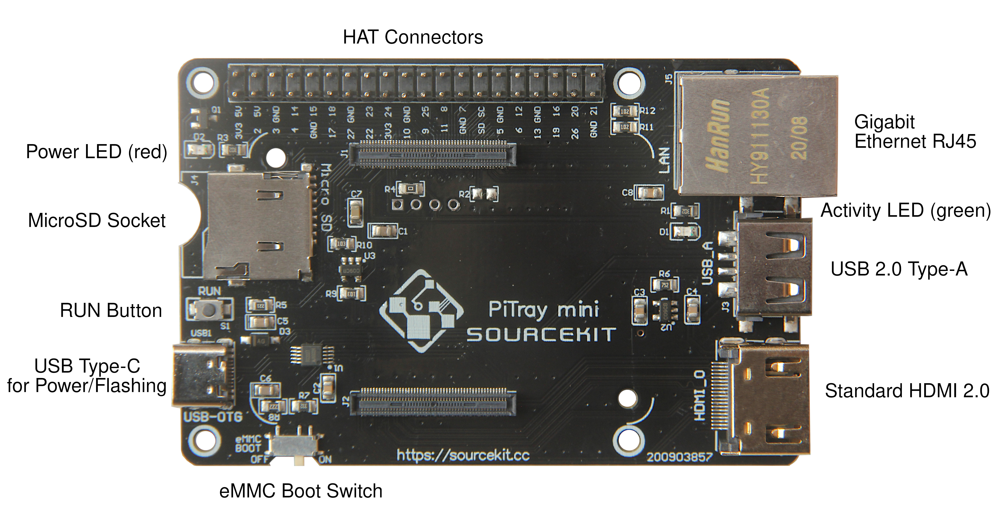
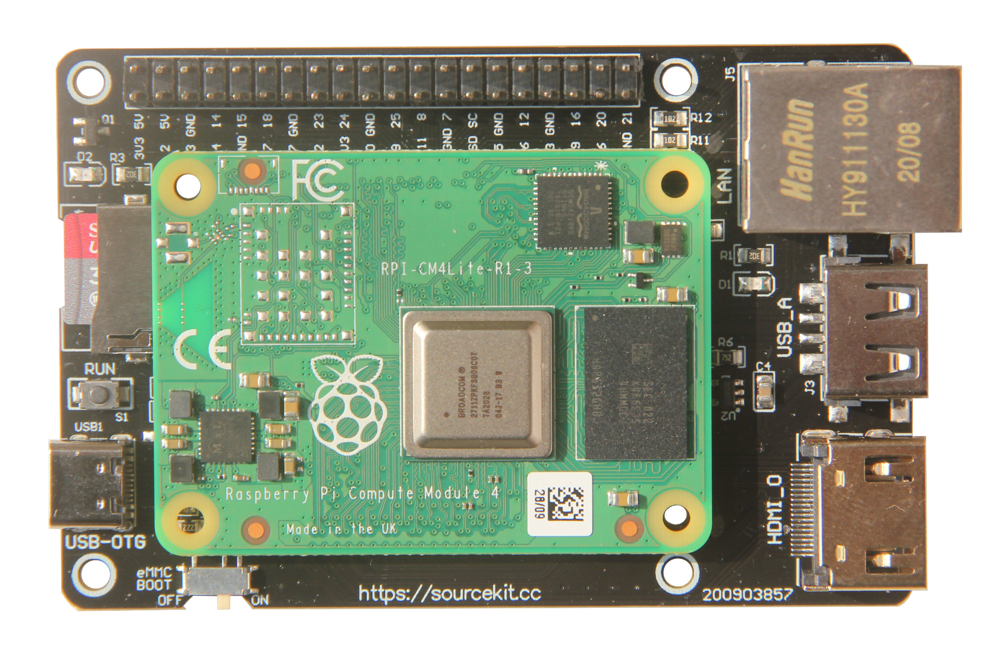
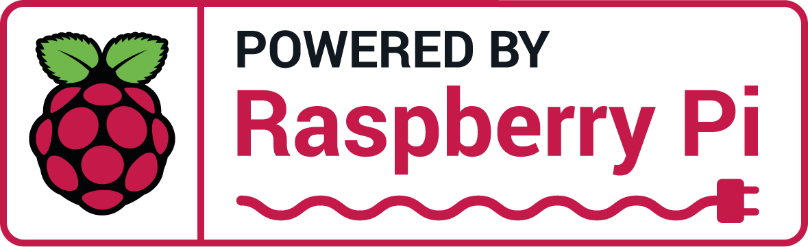

# Sourcekit® PiTray mini

版本：1.1.0

Language: [English](PiTray-mini), 简体中文

设计人：方圣源，官微宏

Sourcekit® PiTray mini是专为搭建搭建树莓派（Raspberry Pi, RPi）第4代计算模块（CM4）而开发的类 B型 (2B/3B/3B+/4B) 树莓派IO载板。PiTray mini旨在为构建 CM4 应用开发提供精巧且经济的解决方案。它具备和标准树莓派4B一样的轮廓和安装孔，可以直接叠加在已有的B型树莓派集群上。

相较于4B，CM4 在产品开发方面更具优势。它发布了板载eMMC存储的版本，抛弃了 SD 卡，这样无论是单独应用还是集群应用，磁盘读写的可靠性和速度都能得到显著提升。于此同时，CM4 也提供了不含 WiFi 蓝牙芯片的系列，这就使得集群的功耗得到进一步的降低，更加节能环保，操作系统也能完全禁用相关服务节省算力。

PiTray mini 提供了接近原生树莓派 4B 的开发体验，希望用户能实现从 4B 到 CM4 平台无缝升级。它提供直接对 CM4 板载 eMMC 烧录的支持，所以也能作为经济简易的[官方 CMIO 板](https://www.raspberrypi.org/products/compute-module-4-io-board/)的替代选择。

# 平面图



# 特点

-   兼容所有类型的 CM4，无论其是否使用板载 eMMC 或是外置 Micro SD 卡作为主存储设备；
-   支持对 CM4 板载 eMMC 的烧录（方法和官方教程相同），而且可以一键切换，更加方便易用；
-   具备和 B 型树莓派（3B/3B+/4B）同样的外形轮廓和定位孔；

# 接口及规格

- 1个 CM4 接口
- 1个树莓派标准 HAT 接口
- 1个标准 HDMI2.0 接口
- 1个千兆以太网 RJ45 接口
- 1个 USB2.0 接口
- 1个 SD 卡槽
- 1个 USB Type-C 接口，用于供电和对CM4板载的eMMC存储器烧写操作系统镜像
- 1个 eMMC 启动切换开关，用来控制系统引导时是编程（烧写）模式或是正常模式
- 1个运行按键，可用于硬复位
- 1组i2c (i2c0) 焊盘
- 1个红色LED电源指示灯
- 1个绿色LED运行指示灯
- 2个 CM4 安装孔
- 4个 CM4 角标用于CM4定位标识

- 尺寸: 85毫米× 56毫米
- 输入电源: +5V
- [外形尺寸](PiTray-mini-mech.pdf ":ignore")

# 入门教程

## CM4 Lite （无板载 eMMC）

1.  准备一张已经烧录树莓派兼容操作系统（如 Raspbian，NOOB，Ubuntu等）的 Micro SD 卡；(参考 [1](https://www.raspberrypi.org/software/) [2](https://www.raspberrypi.org/software/operating-systems/) [3](https://www.raspberrypi.org/documentation/installation/installing-images/) [4](https://projects.raspberrypi.org/en/projects/raspberry-pi-setting-up))

2.  将 Micro SD 卡插入 PiTray mini 的 Micro SD 卡槽；

3.  确认 `eMMC Boot` 开关置于 `ON`；

4.  将 CM4 安装到 PiTray mini 上。_注意：CM4 的方向应该与板上的 CM4 固定孔，以及轮廓标线，否则上电可能导致 CM4 烧毁_

5.  插入其它外设，如 HDMI, 网线、USB（**参考下文**）键盘等；

6.  通过一条功率足够15W（5V 3A）的 USB Type-C 数据线为 PiTray mini 供电。当看到红色电源 LED 亮起，绿色 LED 闪烁，表明 CM4 已经正常启动。

## 带板载 eMMC 的 CM4 (烧录指南)

1.  断开电源，如果 micro SD 卡槽内有卡则将其移除。

2.  将 CM4（含板载 eMMC）安装到 PiTray mini 上。_注意：CM4 的方向应该与板上的 CM4 固定孔，以及轮廓标线，否则上电可能导致 CM4 烧毁_

3.  确认 `eMMC Boot` 开关置于 `OFF`；

4.  在电脑上，安装并运行 [raspberry pi usbboot](https://github.com/raspberrypi/usbboot). (参考 [5](https://www.raspberrypi.org/documentation/hardware/computemodule/cm-emmc-flashing.md))

5.  通过一条标准 USB-A 至 USB-C 数据线将 PiTray mini 连接至电脑。(不可使用双头 USB-C 数据线)

6.  此时，在电脑上可以看到一个新的磁盘外设，像插入优盘或 Micro SD 卡一样，此时可以通过 Raspberry Pi Imager、DD、Etcher 等软件烧录操作系统到该磁盘上；（参考上一节步骤1）

7.  当操作系统烧录完成，可将该磁盘从电脑上移除，并断开 PiTray mini 的电源。

8.  将 `eMMC Boot` 开关置于 `ON`；

9.  插入其它外设，如 HDMI, 网线、USB（**参考下文**）键盘等；

10. 通过一条功率足够15W（5V 3A）的 USB Type-C 数据线为 PiTray mini 供电。当看到红色电源 LED 亮起，绿色 LED 闪烁，表明 CM4 已经正常启动。

* 对于在板载 eMMC 上已经烧录好操作系统的 CM4 来说，直接从第8步开始即可。

# 故障排查

-   USB 外设不工作

> The USB interface is disabled to save power by default on the CM4. To enable it you need to add `dtoverlay=dwc2,dr_mode=host` to the config.txt file

如 [官方文档 Compute Module 4 datasheet](https://datasheets.raspberrypi.org/cm4/cm4-datasheet.pdf)第 4.2 节所示，CM4 为了省电，USB接口默认禁用。如需启用则需要在 `/boot/config.txt` 文件内添加 `dtoverlay=dwc2,dr_mode=host` 这一行。

这个`特性`可能会让许多刚刚接触 CM4，并且期待它与常规树莓派标线一致的用户感到很困惑，尤其是当 USB 键盘是唯一操作系统输入设备的时候。

为了解决这个问题，对于使用 CM4 Lite (不带 eMMC)，先关机，然后将 micro SD 卡通过读卡器重新挂载到电脑上，在 SD 卡的 boot 分区上找到 `config.txt` 文件，并在其末尾添加一行

```
dtoverlay=dwc2,dr_mode=host
```

保存并关闭 config.txt 文件。将 Micro SD 卡从电脑上移除，并插回 PiTray mini 重试。

对于板载 eMMC 的 CM4，与烧写操作系统时候的步骤类似，关机后，将 `eMMC boot` 开关置于 `OFF` 之后，在电脑上运行 usbboot 之后将 PiTray mini 接入，余下步骤与上述一致。当 `config.txt` 文件编辑完成之后，断开 PiTray mini，再将 `eMMC boot` 开关置于 `ON`，最后重新上电重试。

对于有一定经验的树莓派用户来说，编辑 `config.txt` 文件的工作可在操作系统烧写完成后就进行。

对于板载 eMMC 的 CM4，当 `eMMC Boot` 置于 `OFF` 时，操作系统仍可以正常启动。但是此时 USB 外设无法工作，因为此时 CM4 的 USB 接口为`客户机`模式。所以，务必将 `eMMC Boot` 置于 `ON`以保证 USB 接口工作在 `主机`模式。

# 讨论与展示

-   [论坛 (Powered by GitHub Discussion)](https://github.com/aguegu/sourcekit.cc/discussions)
-   [Prototype release on @BG5USN](https://twitter.com/BG5USN/status/1328331941536477189)
-   [neat CM4 projects/accessories - Jeff Geering](https://github.com/geerlingguy/raspberry-pi-pcie-devices/issues/25)
-   [Raspberry Pi CM4 Boards arrive! Waveshare PoE and PiTray mini - Jeff Geering](https://www.youtube.com/watch?v=DKV7wv7NaCY)
-   [Alternative Raspberry Pi Compute Module 4 Carrier Board Offers Familiar Layout - tom's Hardware](https://www.tomshardware.com/news/alternative-raspberry-pi-compute-module-4-carrier-board-offers-familiar-layout)
-   [PiTray Mini Is a CM4 Companion IO Board for Industrial Applications - Hackster.io](https://www.hackster.io/news/pitray-mini-is-a-cm4-companion-io-board-for-industrial-applications-c4ba79f90e18)
-   [RPi CM4 powered PiTray opens at $14.50 as more carriers prep for launch - LinuxGizmos.com](http://linuxgizmos.com/rpi-cm4-powered-pitray-opens-at-14-50-as-more-carriers-prep-for-launch/)
-   [Sourcekit PiTray Mini Review: Brings Ports to Raspberry Pi CM4 - tom's Hardware](https://www.tomshardware.com/reviews/sourcekit-pitray-mini)
-   [The Ultimate Raspberry Pi Compute Module Carrier Board Comparison - upswift](https://www.upswift.io/post/the-ultimate-raspberry-pi-compute-module-carrier-board-comparison)

# 购买通道

<a href="https://www.dfrobot.com.cn/goods-3035.html" target="_blank"></a>
<a href="https://www.maker-shop.ch/pitray-mini-for-raspberry-pi-compute-module-4" target="_blank"></a>
<a href="https://thepihut.com/collections/latest-raspberry-pi-products/products/pitray-mini-for-raspberry-pi-compute-module-4" target="_blank"></a>
<a href="https://www.mouser.com/ProductDetail/DFRobot/DFR0827?qs=DRkmTr78QAQr9inYZfhAoA%3D%3D" target="_blank"></a>

<a href="https://core-electronics.com.au/pitray-mini-for-raspberry-pi-compute-module-4.html" target="_blank"></a>



<a href="sourcekit_pitraymini_cert.pdf" target="_blank"></a>

# 其它产品

<a href="#/PiTray-clip"></a>

[Sourcekit PiTray Clip](#/PiTray-clip)

*Raspberry Pi 是属于树莓派基金会的商标*
