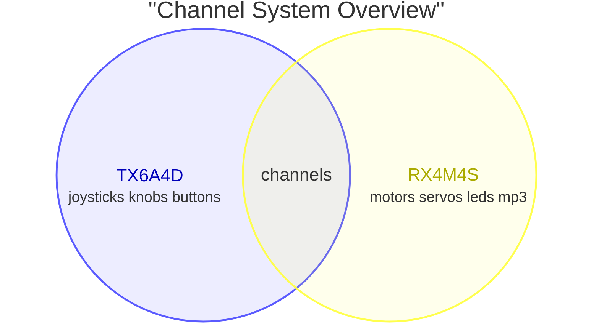

# Sourcekit® MeshMass RX4M4S

Designer:
Weihong Guan [<span class="mdi mdi-github" style="color: #000;" />](https://github.com/aguegu/) [<span class="mdi mdi-twitter" style="color: #1da1f2;" />](https://twitter.com/BG5USN),
Shengyuan Fang,
Donghao Chen [<span class="mdi mdi-printer-3d-nozzle" style="color: #0c0;"/>](https://makerworld.com.cn/zh/@cdhchaoren) [<span class="mdi mdi-television-classic" style="color: #00C;" />](https://space.bilibili.com/24674093)

## Overview

Sourcekit® MeshMass RX4M4S is a programmable receiver module designed for RC applications. It is the companion receiver to the TX6A4D transmitter, forming a complete programmable RC control system.

The RX4M4S provides 4 DC motor outputs and 4 servo outputs, making it ideal for controlling complex vehicles like construction equipment, RC cars, cranes, and custom 3D printed builds. Designed with 3D printing hobbyists in mind, it offers space-efficient integration, built-in motor drivers, and easy programming through a web-based editor.


```
┌─────┬───────────────────┬──────────┬───┬───┬───┬───┬──┬───┬─┬───┬─────┐  
│     │    Onboard        │  ┌────┐  │   │   │   │   │  │ R │ │ M │     │  
│     │        Antenna    │  │PAIR│  │ S │ S │ S │ S │  │ G │ │ P │     │  
│     └───────────────────┘  └────┘  │ M │ M │ M │ M │  │ B │ │ 3 │     │  
│         ┌───┐                      │ 0 │ 1 │ 2 │ 3 │  └───┘ └───┘     │  
│         │Ext│                      │   │   │   │   │  ┌───┐           │  
│         │Ant│                      └───┴───┴───┴───┘  │ O │           │  
│         └───┘                                         │ L │           │  
│                     SOURCEKIT                         │ E │           │  
│                     MeshMass                          │ D │       ┌───┤  
│                     RX4M4S                            └───┘       │ P │  
│                                                                   │ R │  
│                                                     ┌────────────┐│ O │  
│    ┌─────────┐ ┌─────────┐ ┌─────────┐ ┌─────────┐  │            ││ G │  
│    │         │ │         │ │         │ │         │  │  DC Power  │└───┤  
│    │   DM0   │ │   DM1   │ │   DM2   │ │   DM3   │  │  7.4-8.4v  │    │  
│    │         │ │         │ │         │ │         │  │   +    -   │    │  
└────┴─────────┴─┴─────────┴─┴─────────┴─┴─────────┴──┴────────────┴────┘  
```

## Features

- **4 DC Motor Outputs**: For brushed DC motor control (N20, 370, etc.)
- **4 Servo Outputs**: 50Hz PWM outputs (5V, compatible with 9g servos and more)
- **Programmable Channel Mapping**: Map any of the 16 wireless channels to any output
- **Mixing Support**: Combine multiple channels for complex behaviors (tank steering, crane controls)
- **OLED Display Interface**: 6-pin SH1.0 connector for 128x64 SPI OLED (sold separately)
- **WS2812 Neopixel Interface**: 4-pin SH1.0 connector for addressable RGB LED strips (vehicle head/turning/tail lights). **Shares signal pin with SM3** (not included, enabled by a switch in the firmware)
- **Audio Module Interface**: 4-pin SH1.0 connector for optional audio module (MP3 playback for engine start sound effects). **Shares pins with SM1, SM2** (sold separately)
- **Low Latency**: 2.4GHz proprietary protocol optimized for real-time control
- **External Antenna Option**: IPEX-1 connector for external 2.4GHz antenna
- **Compact Design**: Easy to integrate into custom builds

## Specification

### Microcontroller

The RX4M4S is powered by the same WCH CH571F microcontroller as the TX6A4D transmitter, ensuring full protocol compatibility and optimized performance.

| Component | Specification |
|-----------|---------------|
| MCU | WCH CH571F (part of CH57x series) |
| Architecture | 32-bit RISC-V (QingKe V3A core) |
| CPU Speed | 48 MHz (typical) |
| Memory | 32KB SRAM, 256KB Flash |
| Wireless | 2.4GHz proprietary protocol (raw PHY layer for minimum latency) |
| GPIO | Multiple configurable I/O pins |
| PWM | Hardware PWM outputs (used for WS2812 LED control) |
| Timer | Advanced timer for servo PWM generation |
| Peripherals | SPI, UART |

The CH571F's advanced timer capabilities are particularly important for the RX4M4S, enabling precise servo PWM signal generation with minimal CPU overhead. Like the TX6A4D, the receiver utilizes the raw 2.4GHz physical layer for minimum latency in real-time control applications.

### Outputs

| Type | Count | Connector | Description |
|------|-------|-----------|-------------|
| DC Motor | 4 | PH2.0 | Brushed DC motor driver outputs with ~220Hz PWM (DM0-DM3) |
| Servo | 4 | 2.54mm servo header (3-pin) | 50Hz PWM servo outputs (5V) |
| WS2812 Neopixels | 1 (shared) | 4-pin SH1.0 | Addressable RGB LED strips for vehicle lights (head/turning/tail). **Shares signal pin with SM3** (not included, enabled by a switch in the firmware) |
| Audio Module | 1 (optional) | 4-pin SH1.0 | MP3 playback for sound effects (engine start, horns). **Shares pins with SM1, SM2** (sold separately) |

**Motor Outputs (DM0-DM3):**
- 4x PH2.0 connectors for brushed DC motors
- Driven by 4x HXA2820 H-bridge motor drivers (one per channel)
- HXA2820 specifications:
  - Max working voltage: 10.5V (compatible with 2S LiPo)
  - Max continuous current: 2A per channel
  - Max peak current: 3.5A
  - Overtemperature protection: 150°C
- **Key Advantage**: Built-in motor drivers eliminate the need for external ESCs or motor driver boards. Most RC receivers require separate electronic speed controllers (ESCs) for each DC motor, adding cost, weight, and wiring complexity. The RX4M4S integrates 4 motor drivers directly on the board.
- Supports a wide range of low-voltage brushed DC motors (3V-7.4V, 2S LiPo range):
  - **Micro motors**: N20, 610, 716, 718 (micro robots, small mechanisms)
  - **Coreless motors**: 8515, 8520, 1020, 1220 (high-speed, fast response)
  - **Standard RC motors**: 130, 140, 180, 260, 270, 280 series (1/10 scale vehicles)
  - **Medium motors**: R300, 350, 370, 380, 390 series (higher torque applications)
  - **Gear motors**: Any of the above with gearbox reduction for precise control
- PWM speed control (~220Hz) with bidirectional control and braking capability

**Technical Note:** The RX4M4S generates two types of PWM signals:
- **Motor PWM**: ~220Hz frequency for smooth motor speed control. Each DC motor channel uses two complementary PWM outputs to drive the H-bridge for bidirectional control with braking.
- **Servo PWM**: 50Hz (20ms period) standard servo control. Each servo channel uses one PWM output for position control.

**Servo Outputs (SM0-SM3):**
- 4x standard 2.54mm servo headers (3-pin, Dupont style) for standard servos
- Pinout: GND (black) / 5V (red) / Signal (yellow)
- 5V power supply for servos
- Compatible with 9g servos and standard analog/digital servos
- PWM signal: 50Hz (20ms frame), programmable pulse width (typically 1000-2000μs, supports 500-2500μs for extended range servos)

**Pin Sharing & Board Configuration:** The four servo headers are shared with the accessory interfaces. The WS2812 Neopixel interface (for vehicle head/turning/tail lights) **uses the SM3 signal pin**. The audio module interface (for MP3 sound effects like engine start) **uses the SM1 and SM2 pins**. A header can serve one purpose at a time, so fitting an accessory costs you the servo channels it occupies.

One firmware covers every combination. The receiver firmware — published on the MeshMass platform as the **RX4MX** course, *"RX4M4S Fusion Firmware"* — is **config-driven**: you declare which accessories are fitted with two switches at the top of `Project/inc/app.h`, and everything else is derived from them.

```c
#define AUDIO_ON_SM1_SM2 0   // 1 = MP3 audio module on SM1 + SM2
#define NEO_ON_SM3       0   // 1 = WS2812 neopixel strip on SM3
```

The two switches give four board shapes:

| `AUDIO_ON_SM1_SM2` | `NEO_ON_SM3` | DC Motors | Servo headers available | Neopixel | Audio |
|---|---|---|---|---|---|
| `0` | `0` | 4 | SM0 SM1 SM2 SM3 (4) | — | — |
| `0` | `1` | 4 | SM0 SM1 SM2 (3) | SM3 | — |
| `1` | `0` | 4 | SM0 SM3 (2, **sparse**) | — | SM1 + SM2 |
| `1` | `1` | 4 | SM0 (1) | SM3 | SM1 + SM2 |

All four DC motor outputs are always available — the switches only affect the servo headers.

::: warning Servo indices are header labels, not a sequence
`setServo(index, …)` addresses the header by its **silkscreen label**, not by its position among the remaining servos. In the sparse row above (audio fitted, no neopixel) the valid indices are **0 and 3** — there is no servo 1 or 2. Calls to a header that isn't a servo on your configuration are silently ignored.
:::

One firmware, one course, one set of lessons — you configure the board rather than hunting for the right build.

### Power

| Specification | Value |
|---------------|-------|
| Input Voltage | 2S LiPo (7.4V - 8.4V) |
| Battery Connector | XH2.54 |
| Servo Power | 5V regulated output |
| Motor Power | Direct battery input (2S) |
| **Warning** | Only supports 2S LiPo battery. Using other voltage may damage the board. |

### Physical

| Specification | Value |
|---------------|-------|
| Dimensions | 40mm × 60mm |
| Mounting | 4× M2.5 mounting holes |
| Weight | ~15g (without connectors) |
| PCB Color | Black |

### Display & Feedback

| Component | Description |
|-----------|-------------|
| Display Interface | 6-pin SH1.0 connector, SPI interface for 128x64 OLED (sold separately) |
| Programming Interface | 6-pin SH1.0 connector for MeshMass USB Flashing Dongle (sold separately), also provides serial console output |
| Display Shows | Debugging values on a 4-line OLED: received channel values (unsigned `0`-`255`), the 4 motor outputs (signed, with sign), and the 4 servo headers |

**Display Note:** MeshMass shows raw decimal values (not scroll bars or progress indicators) for precise verification. Channel values appear as received — unsigned `0`-`255`, resting near `128` for a centred stick — while motor outputs are shown signed so direction is visible at a glance. This lets students watch a stick's raw number on one line and the recentred, mixed, scaled motor value on another, debugging the maths between them.

Servo headers that a module has claimed show the module instead of a number: SM1 and SM2 read `MP3 ---` when the audio module is enabled, and SM3 reads `RGB` when the neopixel output is enabled — a quick way to confirm the firmware switches match the hardware actually fitted.

The OLED screen is sold separately, making it optional for fixed installations and friendly to budget-conscious builders.

### Connectivity

| Feature | Description |
|---------|-------------|
| Wireless | 2.4GHz auto-hopping (BLE PHY layer only, no GATT) |
| Protocol | Proprietary low-latency RC protocol |
| Pairing | One-to-one binding with TX6A4D via pairing procedure |
| Antenna | Onboard PCB antenna + IPEX-1 connector for external 2.4GHz antenna |
| Range | ~40 meters in open field (onboard PCB antennas), extends with external antenna |

## Pairing

The RX4M4S follows the standard MeshMass pairing system described in the [MeshMass Introduction](/MeshMass-Introduction#pairing-system). Key details specific to the RX4M4S:

- The pairing button is labeled **"PAIR"** on the PCB
- It's controlled by firmware and cannot be reprogrammed for other functions
- The OLED display shows pairing status and confirmation

For complete pairing instructions including EEPROM storage, one-to-one exclusive pairing, and the detailed pairing process, refer to the [Pairing System](/MeshMass-Introduction#pairing-system) section in the MeshMass Introduction.

## Development Guide

The RX4M4S is programmable via the MeshMass online platform at [meshmass.com](https://meshmass.com) (global access) or [meshmass.y77.cc](https://meshmass.y77.cc) (China mainland) using a web browser and the MeshMass USB flashing dongle (sold separately). The CH571F runs pre-built firmware scaffolds that handle low-level RF communication and hardware drivers, while users focus on application-level output mapping logic.

> **Note**: The RX4M4S does not have a built-in charging circuit. Programming and power are supplied through separate connectors.

**What you program:** On RX4M4S, you define how received wireless channels map to motor, servo, and RGB LED outputs. How these channels are generated is determined by the transmitter (TX) firmware.

- Map any of the 16 wireless channels to motor, servo, and RGB LED outputs
- Create mixing functions (e.g., differential steering, crane articulation)
- Configure motor direction and speed curves
- Set servo travel limits, center points, and exponential response
- Implement custom logic for buttons and switches

The MeshMass system is built on a code-based programming approach that combines the flexibility of open hardware with the accessibility of consumer products. For detailed discussion of our design philosophy, competitive advantages, educational value, and system architecture, see the [MeshMass Introduction](/MeshMass-Introduction) page.

**Key advantages for RX4M4S:**

**Built-in Motor Drivers**
- Integrates 4 HXA2820 H-bridge motor drivers directly on the board
- Eliminates need for external ESCs or motor driver boards
- 10.5V max, 2A continuous, 3.5A peak per channel
- Brake capability for precise control
- Supports wide range: N20 micro motors to 370 series medium motors

**Pin Sharing & Board Configuration**
- One firmware (`rx4mx`) covers every accessory combination — two switches in `app.h`, no separate builds
- WS2812 Neopixels use the SM3 signal pin (lights or servo SM3, not both)
- Audio module uses the SM1 and SM2 pins (sound effects or servos SM1/SM2, not both)

**Scaffold Programming Approach**
- Low-level RF, timing, and driver code pre-built
- Focus on application logic and output mapping
- Safety features and connection loss handling built-in

**Real-time Performance**
- 50Hz update rate matches servo refresh
- Minimum latency wireless communication
- Event-driven loop() for responsive control

**Easy Visual Debugging**
- Firmware verification without plugging in executors (which can be powerful but dangerous)
- Transmitter displays battery voltage and signal strength (user holds it in hand)
- Receiver displays debugging values: channels, motor outputs, servo outputs (for mapping verification)
- Aligns with usage patterns: transmitter in hand for system status, receiver remote for output verification


## Firmware Architecture

The RX4M4S runs a pre-built firmware scaffold that handles low-level hardware operations while exposing a simple API for application programming. This architecture separates hardware complexity from application logic, allowing users to focus on output mapping.

### Channel System

The firmware receives 16 raw bytes as wireless channels from the paired transmitter, read with `getChannel(index)` for `index` `0`–`15`. Application code interprets these channel values and maps them to motor, servo, and RGB LED outputs based on the specific vehicle's requirements.

**Channels carry raw, uncentred readings.** `getChannel()` returns an **unsigned** value `0`–`255`. Stick and knob channels carry the transmitter's raw ADC position, with roughly `128` at centre; button channels carry `0` or `1`. The transmitter does no centring, deadzone, scaling, or mixing — **the receiver owns all of it**. Feeding a stick channel straight into `setMotor()` would read the resting centre as a large positive value and drive the motor at speed, so stick channels are almost always passed through a centring helper first (see [Centring a stick channel](#centring-a-stick-channel) below).

**Note:** The channel values received are exactly the bytes the transmitter sends. The transmitter only controls the mapping from physical inputs to channels. How those values become motor, servo, and RGB LED outputs is determined entirely by the application code running on the receiver.



#### Default channel map

What each channel carries is decided by the transmitter's program. The stock TX6A4D program forwards its inputs unchanged, giving this layout:

| Channel | Source | Value |
|---|---|---|
| `0` | Right joystick X (horizontal) | `0`–`255`, ~`128` centred |
| `1` | Right joystick Y (vertical) | `0`–`255`, ~`128` centred |
| `2` | Left joystick Y (vertical) | `0`–`255`, ~`128` centred |
| `3` | Left joystick X (horizontal) | `0`–`255`, ~`128` centred |
| `4` | Left knob | `0`–`255` |
| `5` | Right knob | `0`–`255` |
| `6` | Button 0 | `0` / `1` |
| `7` | Button 1 | `0` / `1` |
| `8` | Button 2 | `0` / `1` |
| `9` | Button 3 | `0` / `1` |
| `10`–`15` | Unused | `0` |

The physical direction each end of the range corresponds to:

| Input | At `0` | At `255` |
|---|---|---|
| Joystick horizontal (X) | Right | Left |
| Joystick vertical (Y) | Down | Up |
| Knob | Fully anticlockwise | Fully clockwise |

So once a stick channel is recentred, **positive means left or up**, negative means right or down.

### Centring a stick channel

Because stick channels arrive raw (`0`–`255`, centre near `128`) and `setMotor()` expects a signed `-127`–`127`, every receiver program needs to recentre them. The reference firmware ships a small `centered()` helper for exactly this, and the lessons all reuse it:

```c
// Center a raw 0..255 stick to a signed -127..+127 swing. The base is a 1:1
// map (0..126 -> -127..-1, 129..255 -> 1..127, center codes 127/128 -> 0),
// bounded to ±127 by construction. The deadzone widens the neutral band and
// rescales the remaining travel so a full-throw stick still reaches ±127;
// deadzone 0 leaves the pure 1:1 map.
static int8_t centered(uint8_t index, uint8_t deadzone) {
  int16_t r = getChannel(index);
  int16_t s = r <= 127 ? r - 127 : r - 128;
  if (s > deadzone) return (s - deadzone) * 127 / (127 - deadzone);
  if (s < -deadzone) return (s + deadzone) * 127 / (127 - deadzone);
  return 0;
}
```

The mapping it produces:

| Raw channel value | `centered()` output |
|---|---|
| `0` – `126` | `-127` – `-1` |
| `127` / `128` | `0` |
| `129` – `255` | `+1` – `+127` |

The `deadzone` argument widens the neutral band around centre, then rescales the remaining travel so a full-throw stick still reaches the extremes:

| `deadzone` | Raw values that output exactly `0` | Full-throw output |
|---|---|---|
| `0` | `127` / `128` (centre only) | `±127` |
| `8` | `119` – `136` | `±127` |
| `20` | `107` – `148` | `±127` |

Use a small deadzone (around `8`) on motor channels so a slightly off-centre stick doesn't creep, and `centered(index, 0)` for servo channels where you want the output to park at an exact centre value.

### Application Code Examples

**Timing Note:** The `loop()` function is called by the firmware scaffold after each successfully received and verified wireless payload from the paired transmitter. Since the transmitter broadcasts at 50Hz (every 20ms), the receiver typically calls `loop()` at 50Hz under normal connection conditions. This matches the typical update frequency of analog servos and ESCs, ensuring smooth control updates.

**Firmware Cycle Details:** After each `loop()` call completes, the motor and servo outputs are updated with the new values. Motor outputs use ~220Hz PWM for speed control, while servo outputs use 50Hz PWM signal (center ~150, range approximately 100-200) for position control.

**Important:** Avoid using busy-waiting or delay functions inside `loop()`. The firmware runs a Real-Time Operating System (RTOS) in the background. Blocking operations can prevent critical system tasks from running, potentially causing system failures or unpredictable behavior.

#### The default program

Out of the box, the receiver runs the four stick channels through `centered()` with a deadzone of `8` to drive the four motors, and drives two mirrored servo pairs from the knob channels. `centered()` is the helper shown [above](#centring-a-stick-channel).

```c
#include "app.h"

void loop() {
  setMotor(0, centered(0, 8));
  setMotor(1, centered(1, 8));
  setMotor(2, centered(2, 8));
  setMotor(3, centered(3, 8));

  // Knob channels 4 and 5 each drive a mirrored servo pair around center
  // (150 = 1.5 ms): SM0/SM1 follow the knob, SM2/SM3 mirror it. Reusing
  // centered(…, 0) parks both at exactly 150 when the knob is centered.
  setServo(0, 150 + centered(4, 0) * 2 / 5);
  setServo(1, 150 + centered(5, 0) * 2 / 5);

  setServo(2, 150 - centered(4, 0) * 2 / 5);
  setServo(3, 150 - centered(5, 0) * 2 / 5);
}
```

#### Failsafe on signal loss

If the radio link drops, `loop()` stops being called and every output **holds its last value** — a vehicle at speed keeps going. To fail safe, implement `onDisconnect()`. The firmware calls it once the link has been quiet for about 400 ms, and cancels the pending call if the link recovers first, so brief interference doesn't trigger it.

```c
// Called when the RF link drops (no packet for ~400 ms). Put the vehicle in a
// safe state: stop all motors and center every servo.
void onDisconnect() {
  for (uint8_t i = 0; i < 4; i++) setMotor(i, 0);
  for (uint8_t i = 0; i < 4; i++) setServo(i, 150);
}
```

`onDisconnect()` is optional — the firmware supplies an empty default — but any vehicle that can drive away from you should define it.

#### Worked examples

Complete, tested programs ship as lessons in the **RX4MX** course on the [MeshMass platform](https://meshmass.com), where they can be compiled and flashed straight to the board. Each one includes a `README` explaining its control scheme and the maths behind it, and the full source is browsable in [chrc-courses](https://github.com/aguegu/chrc-courses).

The vehicle lessons are the ones to read. A few to start with:

- [`02-MiniTank`](https://github.com/aguegu/chrc-courses/tree/main/rx4mx/lessons/02-MiniTank) — a tracked chassis with arcade mixing and three selectable drive modes; the knobs pick the mode and cap the speed.
- [`03-Combo`](https://github.com/aguegu/chrc-courses/tree/main/rx4mx/lessons/03-Combo) — a car with throttle and steering combined on a single stick.
- [`04-forklift`](https://github.com/aguegu/chrc-courses/tree/main/rx4mx/lessons/04-forklift) — the `03-Combo` drivetrain plus mast tilt and lift.
- [`05-Excavator`](https://github.com/aguegu/chrc-courses/tree/main/rx4mx/lessons/05-Excavator) — a four-motor arm, with tracks and attachments on servos.

The course is actively growing, so browse it for the current set — including full builds that add lighting and engine sounds on top of a drivetrain. Lessons named `*Demo` are there to exercise the Neopixel and audio interfaces on their own; they are for checking hardware rather than examples to build a vehicle from.

The lessons are open source (Apache-2.0) and contributions are welcome — if you build something worth sharing, a lesson and the 3D models that go with it are both at home in the repository.

Because every shape of the board runs the same firmware, the lessons form one continuous sequence — you work through them in order rather than switching courses when you fit an accessory.

### Quick Reference

**Core Functions:**
- `getChannel(n)` - Read wireless channel value (**unsigned 0-255**, raw as sent by the transmitter)
- `setMotor(n, value)` - Set motor speed and direction (127: 100% PWM one direction, -127: 100% PWM opposite direction, 0: stop, -128: brake)
- `getMotor(n)` - Get current motor output value
- `setServo(n, value)` - Set servo position (0.01ms units, 150 = 1.5ms center); `n` is the SM header label
- `getServo(n)` - Get current servo output value
- `setup()` - One-time initialization function
- `loop()` - Main application function called after each received payload
- `onDisconnect()` - Called ~400ms after the radio link drops; implement to fail safe

**RGB LED (Neopixel) Functions:** (when `NEO_ON_SM3` is `1`)
- `neo()` - LED animation function called every 125ms
- `neoSetup(pixelCount)` - Initialize Neopixel LED strip (1-32 LEDs)
- `neoSetHSL(n, hue, saturation, lightness)` - Set LED color using HSL color model
- `neoSetColor(index, color, lightness)` - Set LED color using simplified color value

**Audio Functions:** (when `AUDIO_ON_SM1_SM2` is `1`)
- `mpPlay(filesn, force)` - Play audio file from MY1690 audio module (filesn: 1-65535, force: re-trigger the same file while it is already playing)
- `mpStop()` - Stop playback immediately
- `mpVolume(value)` - Set audio playback volume level (0-30, 0 = silent, 30 = maximum)
- `mpLoop(isLoop)` - Loop the current file, or play it once and stop
- `onPlayerReady()` - Callback function called when audio module initialization completes

*For complete function documentation with parameters, return values, and usage notes, see the [API Reference](#api-reference) section below.*

**State Persistence**: Variables that need to retain values between `loop()` calls should be declared as `static` inside `loop()` or as global variables outside functions.

**Standard Library**: Common C standard library functions like `abs()` are available for mathematical operations.

### API Reference

::: details rx4mx Firmware Header File
<<< @/code/en/MeshMass-RX4M4S/rx4mx/app.h{c}
:::

### Firmware-Managed Features

The scaffold handles several system functions automatically:
- **OLED Display**: Real-time debugging display showing channel values, motor outputs, and servo outputs
- **WS2812 Neopixels**: Addressable RGB LED strips for vehicle lights (shares signal pin with SM3)
- **Audio Module**: MP3 playback for sound effects (shares pins with SM1, SM2)
- **Wireless Communication**: Manages 2.4GHz packet reception with auto-hopping
- **Battery Monitoring**: Monitors input voltage and provides low-battery warnings


This separation allows users to focus on application logic (output mapping) while the firmware handles hardware complexities.

## System Architecture

MeshMass separates transmitter and receiver concerns:

- **TX6A4D (Transmitter)**: Maps physical inputs (joysticks, knobs, buttons) to 16 wireless channels
- **RX4M4S (Receiver)**: Maps received channels to physical outputs (motors, servos)

This abstraction lets users focus on what matters most for their specific build without worrying about RF protocol details. The transmitter defines *what* to send (channel values), while the receiver defines *how* to actuate (motor/servo outputs).

## Applications

RX4M4S is ideal for 3D printed construction vehicles and RC models. Sample applications and code templates are available on meshmass.com:

### Construction & Engineering Vehicles
- **Forklift**: 3 N20 motors + 1 9g servo for fork control
- **Dump Truck**: 1 370 motor for drive, 1 N20 motor for dump bed, 1 servo for steering
- **Excavator**: Multiple servos and motors for swing, boom, arm, and bucket control
- **Cranes**: Multi-axis control with precise servo positioning
- **Loader**: Articulated arm control with multiple servo channels

### RC Vehicles & Robotics
- **Tank**: Dual motor differential steering with turret control
- **RC Cars**: Throttle and steering with optional multi-gear transmission
- **Custom 3D printed vehicles**: Fully customizable control schemes
- **Small scale RC airplanes and drones**: Multi-channel control for flight surfaces
- **Custom robotics and automation**: Programmable multi-axis platforms

### Education & Display
- **STEM education projects**: Hands-on learning with immediate feedback
- **Sandbox models and dioramas**: Interactive display models
- **Maker projects**: Combine 3D printing with programmable motion

### Popular Kit Integration
Many 3D printing kit designers create models specifically designed for MeshMass compatibility. These kits often include:
- Pre-flashed firmware for immediate operation
- 3D models designed around the RX4M4S form factor
- Complete wiring diagrams and assembly instructions
- Custom mixing behaviors for specific vehicle types

## Discussion and Show Cases

- [Forum (Powered by GitHub Discussion)](https://github.com/aguegu/sourcekit.cc/discussions)
- [bilibili - 猥琐老虎 - 合集-可编程遥控模块](https://space.bilibili.com/24674093/lists/6826437)

## Where to Buy

- [Taobao - 猥琐老虎遥控玩物](https://dti9o8bd7lkwm7d4o9slcd2h6apezgn.taobao.com)

## Photos


## Related Products

- [TX6A4D Transmitter](/MeshMass-TX6A4D) - Dual joystick transmitter module
- [Mini Tank Starter Kit](/MeshMass-Mini-Tank-Starter-Kit) - Complete 3D-printable tank kit using TX6A4D + RX4M4S, with teacher's guide
- USB Flashing Dongle - Browser-based programming tool (coming soon)
