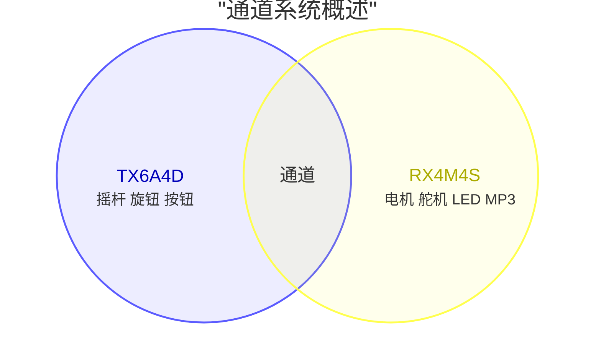

# Sourcekit® MeshMass RX4M4S

设计人:
官微宏 [<span class="mdi mdi-github" style="color: #000;" />](https://github.com/aguegu/) [<span class="mdi mdi-twitter" style="color: #1da1f2;" />](https://twitter.com/BG5USN),
方圣源，
陈东浩 [<span class="mdi mdi-printer-3d-nozzle" style="color: #0c0;"/>](https://makerworld.com.cn/zh/@cdhchaoren) [<span class="mdi mdi-television-classic" style="color: #009;" />](https://space.bilibili.com/24674093)

## 概述

Sourcekit® MeshMass RX4M4S 是一款专为遥控应用设计的可编程接收器模块。它是 TX6A4D 发射器的配套接收器，共同构成完整的可编程遥控控制系统。

RX4M4S 提供 4 路直流电机输出和 4 路舵机输出，非常适合控制复杂的车辆，如工程设备、遥控汽车、起重机和自定义 3D 打印构建。专为 3D 打印爱好者设计，它提供空间高效集成、内置电机驱动器和通过基于 Web 的编辑器轻松编程。


```
┌─────┬───────────────────┬──────────┬───┬───┬───┬───┬──┬───┬─┬───┬─────┐
│     │    Onboard        │  ┌────┐  │   │   │   │   │  │ R │ │ M │     │
│     │        Antenna    │  │PAIR│  │ S │ S │ S │ S │  │ G │ │ P │     │
│     └───────────────────┘  └────┘  │ M │ M │ M │ M │  │ B │ │ 3 │     │
│         ┌───┐                      │ 0 │ 1 │ 2 │ 3 │  └───┘ └───┘     │
│         │Ext│                      │   │   │   │   │  ┌───┐           │
│         │Ant│                      └───┴───┴───┴───┘  │ O │           │
│         └───┘                                         │ L │           │
│                     SOURCEKIT                         │ E │           │
│                     MeshMass                          │ D │       ┌───┤
│                     RX4M4S                            └───┘       │ P │
│                                                                   │ R │
│                                                     ┌────────────┐│ O │
│    ┌─────────┐ ┌─────────┐ ┌─────────┐ ┌─────────┐  │            ││ G │
│    │         │ │         │ │         │ │         │  │  DC Power  │└───┤
│    │   DM0   │ │   DM1   │ │   DM2   │ │   DM3   │  │  7.4-8.4v  │    │
│    │         │ │         │ │         │ │         │  │   +    -   │    │
└────┴─────────┴─┴─────────┴─┴─────────┴─┴─────────┴──┴────────────┴────┘
```

## 特性

- **4 路直流电机输出**: 用于有刷直流电机控制（N20、370 等）
- **4 路舵机输出**: 50Hz PWM 输出（5V，兼容 9g 舵机等）
- **可编程通道映射**: 将任何 16 个无线通道映射到任何输出
- **混控支持**: 组合多个通道实现复杂行为（坦克转向、起重机控制）
- **OLED 显示接口**: 6针 SH1.0 连接器，用于 128x64 SPI OLED（单独出售）
- **WS2812 Neopixel 接口**: 4针 SH1.0 连接器，用于可寻址 RGB LED 灯带（车辆头灯/转向灯/尾灯）。**与 SM3 共享信号引脚**（不包含，通过固件开关启用）
- **音频模块接口**: 4针 SH1.0 连接器，用于可选音频模块（MP3 播放引擎启动音效）。**与 SM1、SM2 共享引脚**（单独出售）
- **低延迟**: 2.4GHz 专有协议，为实时控制优化
- **外置天线选项**: IPEX-1 连接器，用于外置 2.4GHz 天线
- **紧凑设计**: 易于集成到自定义构建中

## 规格

### 微控制器

RX4M4S 采用与 TX6A4D 发射器相同的 WCH CH571F 微控制器，确保完整的协议兼容性和优化性能。

| 组件 | 规格 |
|-----------|---------------|
| MCU | WCH CH571F (CH57x 系列) |
| 架构 | 32位 RISC-V (青稞 V3A 核心) |
| CPU 速度 | 48 MHz (典型值) |
| 内存 | 32KB SRAM, 256KB Flash |
| 无线 | 2.4GHz 专有协议（原始 PHY 层实现最低延迟） |
| GPIO | 多个可配置 I/O 引脚 |
| PWM | 硬件 PWM 输出（用于 WS2812 LED 控制） |
| 定时器 | 高级定时器用于舵机 PWM 生成 |
| 外设 | SPI, UART |

CH571F 的高级定时器功能对 RX4M4S 特别重要，能够以最小的 CPU 开销生成精确的舵机 PWM 信号。与 TX6A4D 一样，接收器利用原始 2.4GHz 物理层实现实时控制应用中的最低延迟。

### 输出

| 类型 | 数量 | 连接器 | 描述 |
|------|-------|-----------|-------------|
| 直流电机 | 4 | PH2.0 | 有刷直流电机驱动器输出，~220Hz PWM (DM0-DM3) |
| 舵机 | 4 | 2.54mm 舵机接头 (3针) | 50Hz PWM 舵机输出 (5V) |
| WS2812 Neopixels | 1 (共享) | 4针 SH1.0 | 可寻址 RGB LED 灯带，用于车辆灯光（头灯/转向灯/尾灯）。**与 SM3 共享信号引脚**（不包含，通过固件开关启用） |
| 音频模块 | 1 (可选) | 4针 SH1.0 | MP3 播放音效（引擎启动、喇叭）。**与 SM1、SM2 共享引脚**（单独出售） |

**电机输出 (DM0-DM3):**
- 4个 PH2.0 连接器，用于有刷直流电机
- 由 4个 HXA2820 H桥电机驱动器驱动（每个通道一个）
- HXA2820 规格：
  - 最大工作电压：10.5V（兼容 2S LiPo）
  - 最大连续电流：每通道 2A
  - 最大峰值电流：3.5A
  - 过温保护：150°C
- **关键优势**：内置电机驱动器消除了对外部电调或电机驱动板的需求。大多数 RC 接收器需要为每个直流电机配备单独的电调，增加了成本、重量和布线复杂性。RX4M4S 直接在板上集成了 4 个电机驱动器。
- 支持广泛的低压有刷直流电机（3V-7.4V，2S LiPo 范围）：
  - **微型电机**：N20、610、716、718（微型机器人、小型机构）
  - **空心杯电机**：8515、8520、1020、1220（高速、快速响应）
  - **标准 RC 电机**：130、140、180、260、270、280 系列（1/10 比例车辆）
  - **中型电机**：R300、350、370、380、390 系列（更高扭矩应用）
  - **齿轮电机**：上述任何电机带减速齿轮箱，实现精确控制
- PWM 速度控制 (~220Hz)，支持双向控制及刹车功能

**技术说明**：RX4M4S 生成两种类型的 PWM 信号：
- **电机 PWM**：~220Hz 频率，实现平滑的电机速度控制。每个直流电机通道使用两个互补的 PWM 输出来驱动 H桥，实现双向控制及刹车操作。
- **舵机 PWM**：50Hz（20ms 周期）标准舵机控制。每个舵机通道使用一个 PWM 输出进行位置控制。

**舵机输出 (SM0-SM3):**
- 4个标准 2.54mm 舵机接头（3针，杜邦线样式），用于标准舵机
- 引脚排列：GND (黑色) / 5V (红色) / 信号 (黄色)
- 5V 电源供电给舵机
- 兼容 9g 舵机和标准模拟/数字舵机
- PWM 信号：50Hz（20ms 帧），可编程脉冲宽度（通常 1000-2000μs，支持 500-2500μs 用于扩展范围舵机）

**引脚共享与板型配置**：4 个舵机排针与配件接口共享引脚。WS2812 灯带接口（用于车辆头灯/转向灯/尾灯）**占用 SM3 的信号引脚**；音频模块接口（用于引擎启动等 MP3 音效）**占用 SM1、SM2 两个引脚**。一个排针同一时间只能承担一种用途，因此装上配件就要让出它所占的舵机通道。

不需要为每种组合挑选不同的固件。接收机固件在 MeshMass 平台上发布为 **RX4MX** 课程（*"RX4M4S Fusion Firmware"*），采用**配置驱动**：在 `Project/inc/app.h` 顶部用两个开关声明装了哪些配件，其余全部由此推导。

```c
#define AUDIO_ON_SM1_SM2 0   // 1 = SM1+SM2 接 MP3 音频模块
#define NEO_ON_SM3       0   // 1 = SM3 接 WS2812 灯带
```

两个开关组合出四种板型：

| `AUDIO_ON_SM1_SM2` | `NEO_ON_SM3` | 直流电机 | 可用舵机排针 | 灯带 | 音频 |
|---|---|---|---|---|---|
| `0` | `0` | 4 | SM0 SM1 SM2 SM3（4 路） | — | — |
| `0` | `1` | 4 | SM0 SM1 SM2（3 路） | SM3 | — |
| `1` | `0` | 4 | SM0 SM3（2 路，**不连续**） | — | SM1 + SM2 |
| `1` | `1` | 4 | SM0（1 路） | SM3 | SM1 + SM2 |

4 路直流电机输出始终可用——开关只影响舵机排针。

::: warning 舵机序号是排针编号，不是顺序编号
`setServo(index, …)` 用的是丝印上的**排针编号**，而不是它在剩余舵机中的排位。上表中「装了音频、没装灯带」那一行，有效序号是 **0 和 3**——不存在 1 号和 2 号舵机。对本配置下并非舵机的排针调用该函数会被直接忽略。
:::

一套固件、一个课程、一条课程序列——你配置板子，而不是去找对应的固件版本。

### 电源

| 规格 | 值 |
|---------------|-------|
| 输入电压 | 2S LiPo (7.4V - 8.4V) |
| 电池连接器 | XH2.54 |
| 舵机电源 | 5V 稳压输出 |
| 电机电源 | 直接电池输入 (2S) |
| **警告** | 仅支持 2S LiPo 电池。使用其他电压可能损坏电路板。 |

### 物理特性

| 规格 | 值 |
|---------------|-------|
| 尺寸 | 40mm × 60mm |
| 安装 | 4× M2.5 安装孔 |
| 重量 | ~15g (无连接器) |
| PCB 颜色 | 黑色 |

### 显示与反馈

| 组件 | 描述 |
|-----------|-------------|
| 显示接口 | 6针 SH1.0 连接器，SPI 接口用于 128x64 OLED（单独出售） |
| 编程接口 | 6针 SH1.0 连接器，用于 MeshMass USB 烧录器（单独出售），同时提供串口控制台输出 |
| 显示内容 | 4 行 OLED 上的调试值：接收到的通道值（无符号 `0`-`255`）、4 路电机输出（带符号，显示正负号）、以及 4 个舵机排针 |

**显示说明**：MeshMass 显示原始十进制数值（非滚动条或进度指示器），便于精确验证。通道值按接收到的原样显示——无符号 `0`-`255`，摇杆居中时约为 `128`；电机输出则带符号显示，方向一目了然。学生可以在一行上看摇杆的原始读数，在另一行上看经过居中、混控、缩放之后的电机输出值，从而调试中间的运算。

被模块占用的舵机排针不显示数值，而是显示模块标记：启用音频模块时 SM1、SM2 显示 `MP3 ---`，启用灯带时 SM3 显示 `RGB`——这也是确认固件开关与实际装配是否一致的快捷方法。

OLED 屏幕单独出售，对于固定安装是可选的，对预算有限的构建友好。

### 连接性

| 特性 | 描述 |
|---------|-------------|
| 无线 | 2.4GHz 自动跳频（仅使用 BLE PHY 层，无 GATT） |
| 协议 | 专有低延迟 RC 协议 |
| 配对 | 通过配对程序与 TX6A4D 进行一对一绑定 |
| 天线 | 板载 PCB 天线 + IPEX-1 连接器用于外置 2.4GHz 天线 |
| 距离 | 开阔地带约 40 米（使用板载 PCB 天线），使用外置天线可扩展距离 |

## 配对

RX4M4S 遵循 [MeshMass 简介](/zh/MeshMass-Introduction#pairing-system)中描述的标准 MeshMass 配对系统。RX4M4S 特定的关键细节：

- 配对按钮在 PCB 上标记为 **"PAIR"**
- 它由固件控制，不能重新编程用于其他功能
- OLED 显示配对状态和确认

有关完整的配对说明，包括 EEPROM 存储、一对一独占配对和详细配对流程，请参阅 MeshMass 简介中的[配对系统](/zh/MeshMass-Introduction#pairing-system)部分。

## 设计理念

MeshMass 系统基于代码编程方法构建，结合了开源硬件的灵活性和消费产品的易用性。有关我们的设计理念、竞争优势、教育价值和系统架构的详细讨论，请参阅 [MeshMass 简介](/zh/MeshMass-Introduction)页面。

**RX4M4S 的关键优势：**

**内置电机驱动器**
- 直接在板上集成 4 个 HXA2820 H桥电机驱动器
- 消除对外部电调或电机驱动板的需求
- 每通道最大 10.5V，2A 连续电流，3.5A 峰值电流
- 刹车能力实现精确控制
- 支持广泛范围：从 N20 微型电机到 370 系列中型电机

**引脚共享与板型配置**
- 一套固件（`rx4mx`）覆盖所有配件组合——`app.h` 里两个开关，无需分别下载
- WS2812 灯带占用 SM3 的信号引脚（灯光与舵机 SM3 不能同时用）
- 音频模块占用 SM1、SM2 引脚（音效与舵机 SM1/SM2 不能同时用）

**框架编程方法**
- 预构建底层 RF、时序和驱动程序代码
- 专注于应用逻辑和输出映射
- 内置安全功能和连接丢失处理

**实时性能**
- 50Hz 更新速率匹配舵机刷新
- 最低延迟无线通信
- 事件驱动的 loop() 实现响应式控制

**易视觉调试**
- 无需插入执行器即可验证固件（执行器可能功能强大但危险）
- 发射器显示电池电压和信号强度（用户握在手中）
- 接收器显示调试值：通道、电机输出、舵机输出（用于映射验证）
- 符合使用模式：发射器在手中用于系统状态，接收器远程用于输出验证

## 编程

RX4M4S 可通过 MeshMass 在线平台 [meshmass.com](https://meshmass.com)（全球访问）或 [meshmass.y77.cc](https://meshmass.y77.cc)（中国大陆访问）进行编程。用户可以：

- 将任何 16 个无线通道映射到电机、舵机和 RGB LED 输出
- 创建混合函数（例如差速转向、起重机关节控制）
- 配置电机方向和速度曲线
- 设置舵机行程限制、中心点和指数响应
- 实现按钮和开关的自定义逻辑

编程通过网页浏览器使用 MeshMass USB 烧录器（单独出售）完成。CH571F 运行预构建的固件框架，处理底层 RF 通信、时序和硬件驱动程序，而用户专注于应用级输出映射逻辑。这种框架方法意味着您只编写对特定车辆重要的代码——无需理解无线协议或 PWM 时序细节。

打开一课，在浏览器里改代码、编译，然后把结果烧录进去——**无需注册账号**。工具链和固件内核都在服务器上，本地不用安装任何东西。

::: warning 你的修改不会被保存
平台会编译你提交的源码，但不会保存它。你在浏览器里做的修改，一旦离开或刷新页面就会丢失——**想留下的代码，请自己另存一份。** 对课堂来说，这意味着要让学生在下课前把自己的成果复制到别的地方保存好。
:::

> **注意**：RX4M4S 没有内置充电电路。编程和电源通过单独的连接器提供。

## 固件框架

RX4M4S 运行预构建的固件框架，处理底层硬件操作，同时为应用编程提供简单的 API。

### 通道系统

固件从配对的发射器接收 16 个原始字节作为无线通道，用 `getChannel(index)` 读取，`index` 取值 `0`-`15`。应用程序代码解释这些通道值，并根据具体车辆的需求把它们映射到电机、舵机和 RGB LED 输出。

**通道里装的是未经处理的原始读数。** `getChannel()` 返回**无符号**的 `0`-`255`。摇杆和旋钮通道装的是发射器的原始 ADC 位置，居中时约为 `128`；按键通道装的是 `0` 或 `1`。发射器不做任何居中、死区、缩放或混控——**这些全部由接收机负责**。把摇杆通道直接喂给 `setMotor()`，静止时的中点会被当成一个很大的正值、把电机拉到高速，所以摇杆通道基本都要先经过一个居中函数（见下文[摇杆通道的居中处理](#摇杆通道的居中处理)）。

**注意**：接收到的通道值正是发射器发出的字节。发射器只决定物理输入到通道的映射；这些值如何变成电机、舵机和 RGB LED 输出，完全取决于运行在接收机上的应用程序代码。



#### 默认通道分配

每个通道装什么，由发射器的程序决定。发射器的默认程序把输入原样转发，得到下面的分配：

| 通道 | 来源 | 取值 |
|---|---|---|
| `0` | 右摇杆 X（水平） | `0`-`255`，约 `128` 居中 |
| `1` | 右摇杆 Y（垂直） | `0`-`255`，约 `128` 居中 |
| `2` | 左摇杆 Y（垂直） | `0`-`255`，约 `128` 居中 |
| `3` | 左摇杆 X（水平） | `0`-`255`，约 `128` 居中 |
| `4` | 左旋钮 | `0`-`255` |
| `5` | 右旋钮 | `0`-`255` |
| `6` | 按键 0 | `0` / `1` |
| `7` | 按键 1 | `0` / `1` |
| `8` | 按键 2 | `0` / `1` |
| `9` | 按键 3 | `0` / `1` |
| `10`-`15` | 未使用 | `0` |

原始读数两端对应的物理方向：

| 输入 | `0` 端 | `255` 端 |
|---|---|---|
| 摇杆水平轴（X） | 右 | 左 |
| 摇杆垂直轴（Y） | 下 | 上 |
| 旋钮 | 逆时针到底 | 顺时针到底 |

所以摇杆通道经过居中之后，**正值对应「左」或「上」**，负值对应「右」或「下」。

### 摇杆通道的居中处理

摇杆通道送来的是原始值（`0`-`255`，中点约 `128`），而 `setMotor()` 要的是带符号的 `-127`-`127`，因此每个接收机程序都需要把它重新居中。参考固件提供了一个 `centered()` 辅助函数专门做这件事，各课程也都直接复用它：

```c
// 把原始的 0..255 摇杆读数居中为带符号的 -127..+127。基础是 1:1 映射
//（0..126 -> -127..-1，129..255 -> 1..127，中点码 127/128 -> 0），
// 由构造保证不超出 ±127。死区会加宽中点附近的静止区间，并把剩余行程
// 重新缩放，使满行程仍能到达 ±127；死区为 0 时就是纯 1:1 映射。
static int8_t centered(uint8_t index, uint8_t deadzone) {
  int16_t r = getChannel(index);
  int16_t s = r <= 127 ? r - 127 : r - 128;
  if (s > deadzone) return (s - deadzone) * 127 / (127 - deadzone);
  if (s < -deadzone) return (s + deadzone) * 127 / (127 - deadzone);
  return 0;
}
```

它产生的映射：

| 通道原始读数 | `centered()` 输出 |
|---|---|
| `0` – `126` | `-127` – `-1` |
| `127` / `128` | `0` |
| `129` – `255` | `+1` – `+127` |

`deadzone` 参数加宽中点附近的静止区间，并把剩余行程重新缩放，使满行程仍能到达两端：

| `deadzone` | 输出恒为 `0` 的原始读数 | 满行程输出 |
|---|---|---|
| `0` | `127` / `128`（仅中点） | `±127` |
| `8` | `119` – `136` | `±127` |
| `20` | `107` – `148` | `±127` |

电机通道建议用一个较小的死区（`8` 左右），这样摇杆稍微偏离中点时车子不会自己爬行；舵机通道则常用 `centered(index, 0)`，让输出能停在准确的中位值上。

### 应用程序代码示例

**时序说明**：`loop()` 函数由固件框架在每次成功接收并验证来自配对发射器的无线数据包后调用。由于发射器以 50Hz（每 20ms）广播，接收器在正常连接条件下通常以 50Hz 调用 `loop()`。这与模拟舵机和电调的典型更新频率匹配，确保平滑的控制更新。

**固件周期详情**：每次 `loop()` 调用完成后，电机和舵机输出会更新为新值。电机输出使用 ~220Hz PWM 进行速度控制，而舵机输出使用 50Hz PWM 信号（中心 ~150，范围约 100-200）进行位置控制。

**重要提示**：避免在 `loop()` 函数中使用忙等待或延时函数。固件在后台运行实时操作系统（RTOS）。阻塞操作会阻止关键系统任务运行，可能导致系统故障或不可预测的行为。

#### 默认程序

出厂状态下，接收机把 4 个摇杆通道经 `centered()`（死区 `8`）驱动 4 路电机，并用两个旋钮通道各驱动一对镜像舵机。`centered()` 就是[上文](#摇杆通道的居中处理)那个辅助函数。

```c
#include "app.h"

void loop() {
  setMotor(0, centered(0, 8));
  setMotor(1, centered(1, 8));
  setMotor(2, centered(2, 8));
  setMotor(3, centered(3, 8));

  // 旋钮通道 4 和 5 各驱动一对围绕中位（150 = 1.5ms）镜像的舵机：
  // SM0/SM1 跟随旋钮，SM2/SM3 反向镜像。这里复用 centered(…, 0)，
  // 使旋钮居中时两者都精确停在 150。
  setServo(0, 150 + centered(4, 0) * 2 / 5);
  setServo(1, 150 + centered(5, 0) * 2 / 5);

  setServo(2, 150 - centered(4, 0) * 2 / 5);
  setServo(3, 150 - centered(5, 0) * 2 / 5);
}
```

#### 信号丢失时的失效保护

如果无线链路中断，`loop()` 就不再被调用，所有输出会**保持最后一次的值**——正在全速行驶的车子会继续开下去。要让它安全停下，请实现 `onDisconnect()`。链路静默约 400ms 后固件会调用它一次；若链路先恢复，这次调用会被取消，因此短暂干扰不会触发。

```c
// 无线链路中断（约 400ms 未收到数据包）时调用。
// 让车辆进入安全状态：停止所有电机，所有舵机回中位。
void onDisconnect() {
  for (uint8_t i = 0; i < 4; i++) setMotor(i, 0);
  for (uint8_t i = 0; i < 4; i++) setServo(i, 150);
}
```

`onDisconnect()` 是可选的——固件提供了一个空的默认实现——但任何可能开离你身边的车辆都应该定义它。

#### 参考示例

完整且经过验证的程序，作为 **RX4MX** 课程发布在 [MeshMass 平台](https://meshmass.y77.cc)上，可以直接编译并烧录到板子上。每一课都附带 `README`，说明它的操作方式和背后的运算；完整源码可在 [chrc-courses](https://gitee.com/aGuegu/chrc-courses) 浏览。

值得细读的是整车类的课程，可以从这几课开始：

- [`02-MiniTank`](https://gitee.com/aGuegu/chrc-courses/tree/main/rx4mx/lessons/02-MiniTank) —— 双履带底盘，arcade 混控，三种可切换的驾驶模式；两个旋钮分别选模式和限速。
- [`03-Combo`](https://gitee.com/aGuegu/chrc-courses/tree/main/rx4mx/lessons/03-Combo) —— 单摇杆小车，油门与转向合并到一根摇杆上。
- [`04-forklift`](https://gitee.com/aGuegu/chrc-courses/tree/main/rx4mx/lessons/04-forklift) —— 叉车，在 `03-Combo` 的行驶基础上加入俯仰与举升。
- [`05-Excavator`](https://gitee.com/aGuegu/chrc-courses/tree/main/rx4mx/lessons/05-Excavator) —— 挖掘机，4 路电机驱动机械臂，履带与附件用舵机。

课程仍在持续增加，最新的一套请直接在课程里浏览——其中也包括在行驶基础上加上灯光与引擎声的整车演示。名字里带 `*Demo` 的课程是用来单独验证灯带和音频接口的，属于硬件自检，而不是用来照着做整车的范例。

这些课程是开源的（Apache-2.0），也欢迎大家贡献——如果你做出了值得分享的作品，课程代码和配套的 3D 模型都可以放进这个仓库。向仓库投稿是免费的，平台的课程也会从仓库同步过来。若想在平台上发布你自己的课程，则需要会员资格。

因为所有板型都跑同一套固件，这些课程构成一条连续的序列——按顺序做下去即可，装上配件时也不需要切换到别的课程。

### API 函数

**核心函数：**
- `getChannel(n)` - 读取无线通道值（**无符号 0-255**，发射器发出的原始值）
- `setMotor(n, value)` - 设置电机速度和方向 (127: 100% PWM 一个方向, -127: 100% PWM 相反方向, 0: 停止, -128: 刹车)
- `getMotor(n)` - 获取当前电机输出值
- `setServo(n, value)` - 设置舵机位置 (0.01ms 单位，150 = 1.5ms 中位)；`n` 为 SM 排针编号
- `getServo(n)` - 获取当前舵机输出值
- `setup()` - 一次性初始化函数
- `loop()` - 主应用程序函数，每次接收到有效数据包后调用
- `onDisconnect()` - 无线链路中断约 400ms 后调用，用于实现失效保护

**RGB LED (Neopixel) 函数：**（`NEO_ON_SM3` 为 `1` 时可用）
- `neo()` - LED 动画函数，每 125ms 调用一次
- `neoSetup(pixelCount)` - 初始化 Neopixel LED 灯带 (1-32 个 LED)
- `neoSetHSL(n, hue, saturation, lightness)` - 使用 HSL 颜色模型设置 LED 颜色
- `neoSetColor(index, color, lightness)` - 使用简化颜色值设置 LED 颜色

**音频函数：**（`AUDIO_ON_SM1_SM2` 为 `1` 时可用）
- `mpPlay(filesn, force)` - 从 MY1690 音频模块播放音频文件 (filesn: 1-65535, force: 同一文件正在播放时是否重新触发)
- `mpStop()` - 立即停止播放
- `mpVolume(value)` - 设置音频播放音量级别 (0-30, 0 = 静音, 30 = 最大音量)
- `mpLoop(isLoop)` - 循环播放当前文件，或播放一次后停止
- `onPlayerReady()` - 音频模块初始化完成时调用的回调函数

*完整的函数文档包含参数、返回值和用法说明，请参阅下面的 [API 参考](#api-参考) 部分。*

**状态持久性**：需要在 `loop()` 调用之间保持值的变量应声明为 `static` 在 `loop()` 内部或作为全局变量在函数外部声明。

**标准库**：常见的 C 标准库函数如 `abs()` 可用于数学运算。

### API 参考

::: details rx4mx 固件头文件
<<< @/code/zh/MeshMass-RX4M4S/rx4mx/app.h{c}
:::

### 固件管理的功能

框架自动处理多个系统功能：
- **OLED 显示**：实时调试显示，显示通道值、电机输出和舵机输出。显示原始十进制数值（非简化可视化），便于精确验证。OLED 单独出售，对于固定安装是可选的。
- **WS2812 Neopixels**：可寻址 RGB LED 灯带，用于车辆灯光（头灯/转向灯/尾灯）。**与 SM3 共享信号引脚**
- **音频模块**：MP3 播放音效（引擎启动、喇叭）。**与 SM1、SM2 共享引脚**（模块单独出售）
- **无线通信**：管理 2.4GHz 数据包接收与自动跳频
- **电池监测**：监测输入电压并提供低电量警告

这种分离让用户能够专注于应用逻辑（输出映射），而固件处理硬件复杂性。

## 系统架构

MeshMass 系统将发射器和接收器的关注点分离：

- **TX6A4D (发射器)**: 将物理输入（摇杆、旋钮、按钮）映射到 16 个无线通道
- **RX4M4S (接收器)**: 将接收到的通道映射到物理输出（电机、舵机、RGB LED）

这种抽象让用户能够专注于特定构建中最重要的部分，而无需担心 RF 协议细节。发射器定义*发送什么*（通道值），而接收器定义*如何驱动*（电机/舵机/RGB LED 输出）。

## 应用

RX4M4S 非常适合 3D 打印工程车辆和 RC 模型。meshmass.com 上提供示例应用和代码模板：

### 工程与工程车辆
- **叉车**：3 个 N20 电机 + 1 个 9g 舵机用于叉子控制
- **自卸车**：1 个 370 电机用于驱动，1 个 N20 电机用于自卸斗，1 个舵机用于转向
- **挖掘机**：多个舵机和电机用于回转、动臂、斗杆和铲斗控制
- **起重机**：多轴控制，具有精确的舵机定位
- **装载机**：多舵机通道的关节臂控制

### RC 车辆与机器人
- **坦克**：双电机差速转向与炮塔控制
- **遥控汽车**：油门和转向，可选多档变速箱
- **自定义 3D 打印车辆**：完全可定制的控制方案
- **小型遥控飞机和无人机**：飞行面的多通道控制
- **自定义机器人和自动化**：可编程多轴平台

### 教育与展示
- **STEM 教育项目**：即时反馈的动手学习
- **沙盘模型和场景模型**：交互式展示模型
- **创客项目**：结合 3D 打印与可编程运动

### 热门套件集成
许多 3D 打印套件设计师创建专门为 MeshMass 兼容性设计的模型。这些套件通常包括：
- 预烧录固件，实现即用操作
- 围绕 RX4M4S 外形设计的 3D 模型
- 完整的接线图和组装说明
- 特定车辆类型的自定义混合行为

## 讨论与展示

- [论坛（由 GitHub Discussion 提供支持）](https://github.com/aguegu/sourcekit.cc/discussions)
- [bilibili - 猥琐老虎 - 合集-可编程遥控模块](https://space.bilibili.com/24674093/lists/6826437)

## 购买渠道

- [淘宝 - 猥琐老虎遥控玩物](https://dti9o8bd7lkwm7d4o9slcd2h6apezgn.taobao.com)

## 产品照片


## 相关产品

- [TX6A4D 发射器](/zh/MeshMass-TX6A4D) - 双摇杆发射器模块
- USB 烧录器 - 基于浏览器的编程工具（即将推出）
