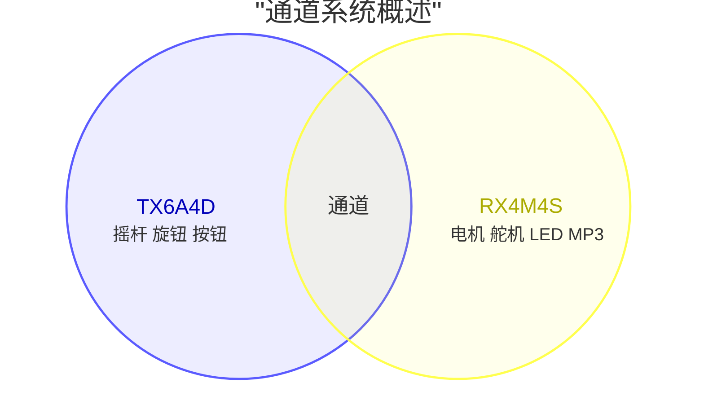

# Sourcekit® MeshMass RX4M4S

版本: 1.0.0

设计人:
官微宏 [<span class="mdi mdi-github" style="color: #000;" />](https://github.com/aguegu/) [<span class="mdi mdi-twitter" style="color: #1da1f2;" />](https://twitter.com/BG5USN),
方圣源，
陈东浩 [<span class="mdi mdi-printer-3d-nozzle" style="color: #0c0;"/>](https://makerworld.com.cn/zh/@cdhchaoren) [<span class="mdi mdi-television-classic" style="color: #009;" />](https://space.bilibili.com/24674093)

## 概述

Sourcekit® MeshMass RX4M4S 是一款专为遥控应用设计的可编程接收器模块。它是 TX6A4D 发射器的配套接收器，共同构成完整的可编程遥控控制系统。

RX4M4S 提供 4 路直流电机输出和 4 路舵机输出，非常适合控制复杂的车辆，如工程设备、遥控汽车、起重机和自定义 3D 打印构建。专为 3D 打印爱好者设计，它提供空间高效集成、内置电机驱动器和通过基于 Web 的编辑器轻松编程。


```
┌─────┬───────────────────┬──────────┬───┬───┬───┬───┬──┬───┬─┬───┬─────┐
│     │    Onboard        │  ┌────┐  │   │   │   │   │  │ R │ │ M │     │
│     │        Antenna    │  │PAIR│  │ S │ S │ S │ S │  │ G │ │ P │     │
│     └───────────────────┘  └────┘  │ M │ M │ M │ M │  │ B │ │ 3 │     │
│         ┌───┐                      │ 0 │ 1 │ 2 │ 3 │  └───┘ └───┘     │
│         │Ext│                      │   │   │   │   │  ┌───┐           │
│         │Ant│                      └───┴───┴───┴───┘  │ O │           │
│         └───┘                                         │ L │           │
│                     SOURCEKIT                         │ E │           │
│                     MeshMass                          │ D │       ┌───┤
│                     RX4M4S                            └───┘       │ P │
│                                                                   │ R │
│                                                     ┌────────────┐│ O │
│    ┌─────────┐ ┌─────────┐ ┌─────────┐ ┌─────────┐  │            ││ G │
│    │         │ │         │ │         │ │         │  │  DC Power  │└───┤
│    │   DM0   │ │   DM1   │ │   DM2   │ │   DM3   │  │  7.4-8.4v  │    │
│    │         │ │         │ │         │ │         │  │   +    -   │    │
└────┴─────────┴─┴─────────┴─┴─────────┴─┴─────────┴──┴────────────┴────┘
```

## 特性

- **4 路直流电机输出**: 用于有刷直流电机控制（N20、370 等）
- **4 路舵机输出**: 50Hz PWM 输出（5V，兼容 9g 舵机等）
- **可编程通道映射**: 将任何 16 个无线通道映射到任何输出
- **混控支持**: 组合多个通道实现复杂行为（坦克转向、起重机控制）
- **OLED 显示接口**: 6针 SH1.0 连接器，用于 128x64 SPI OLED（单独出售）
- **WS2812 Neopixel 接口**: 4针 SH1.0 连接器，用于可寻址 RGB LED 灯带（车辆头灯/转向灯/尾灯）。**与 SM3 共享信号引脚**（不包含，需要特殊固件）
- **音频模块接口**: 4针 SH1.0 连接器，用于可选音频模块（MP3 播放引擎启动音效）。**与 SM1、SM2 共享引脚**（单独出售，正在开发中）
- **低延迟**: 2.4GHz 专有协议，为实时控制优化
- **外置天线选项**: IPEX-1 连接器，用于外置 2.4GHz 天线
- **紧凑设计**: 易于集成到自定义构建中

## 规格

### 微控制器

RX4M4S 采用与 TX6A4D 发射器相同的 WCH CH571F 微控制器，确保完整的协议兼容性和优化性能。

| 组件 | 规格 |
|-----------|---------------|
| MCU | WCH CH571F (CH57x 系列) |
| 架构 | 32位 RISC-V (青稞 V3A 核心) |
| CPU 速度 | 48 MHz (典型值) |
| 内存 | 32KB SRAM, 256KB Flash |
| 无线 | 2.4GHz 专有协议（原始 PHY 层实现最低延迟） |
| GPIO | 多个可配置 I/O 引脚 |
| PWM | 硬件 PWM 输出（用于 WS2812 LED 控制） |
| 定时器 | 高级定时器用于舵机 PWM 生成 |
| 外设 | SPI, UART |

CH571F 的高级定时器功能对 RX4M4S 特别重要，能够以最小的 CPU 开销生成精确的舵机 PWM 信号。与 TX6A4D 一样，接收器利用原始 2.4GHz 物理层实现实时控制应用中的最低延迟。

### 输出

| 类型 | 数量 | 连接器 | 描述 |
|------|-------|-----------|-------------|
| 直流电机 | 4 | PH2.0 | 有刷直流电机驱动器输出，~220Hz PWM (DM0-DM3) |
| 舵机 | 4 | 2.54mm 舵机接头 (3针) | 50Hz PWM 舵机输出 (5V) |
| WS2812 Neopixels | 1 (共享) | 4针 SH1.0 | 可寻址 RGB LED 灯带，用于车辆灯光（头灯/转向灯/尾灯）。**与 SM3 共享信号引脚**（不包含，需要特殊固件） |
| 音频模块 | 1 (可选) | 4针 SH1.0 | MP3 播放音效（引擎启动、喇叭）。**与 SM1、SM2 共享引脚**（单独出售，正在开发中） |

**电机输出 (DM0-DM3):**
- 4个 PH2.0 连接器，用于有刷直流电机
- 由 4个 HXA2820 H桥电机驱动器驱动（每个通道一个）
- HXA2820 规格：
  - 最大工作电压：10.5V（兼容 2S LiPo）
  - 最大连续电流：每通道 2A
  - 最大峰值电流：3.5A
  - 过温保护：150°C
- **关键优势**：内置电机驱动器消除了对外部电调或电机驱动板的需求。大多数 RC 接收器需要为每个直流电机配备单独的电调，增加了成本、重量和布线复杂性。RX4M4S 直接在板上集成了 4 个电机驱动器。
- 支持广泛的低压有刷直流电机（3V-7.4V，2S LiPo 范围）：
  - **微型电机**：N20、610、716、718（微型机器人、小型机构）
  - **空心杯电机**：8515、8520、1020、1220（高速、快速响应）
  - **标准 RC 电机**：130、140、180、260、270、280 系列（1/10 比例车辆）
  - **中型电机**：R300、350、370、380、390 系列（更高扭矩应用）
  - **齿轮电机**：上述任何电机带减速齿轮箱，实现精确控制
- PWM 速度控制 (~220Hz)，支持双向控制及刹车功能

**技术说明**：RX4M4S 生成两种类型的 PWM 信号：
- **电机 PWM**：~220Hz 频率，实现平滑的电机速度控制。每个直流电机通道使用两个互补的 PWM 输出来驱动 H桥，实现双向控制及刹车操作。
- **舵机 PWM**：50Hz（20ms 周期）标准舵机控制。每个舵机通道使用一个 PWM 输出进行位置控制。

**舵机输出 (SM0-SM3):**
- 4个标准 2.54mm 舵机接头（3针，杜邦线样式），用于标准舵机
- 引脚排列：GND (黑色) / 5V (红色) / 信号 (黄色)
- 5V 电源供电给舵机
- 兼容 9g 舵机和标准模拟/数字舵机
- PWM 信号：50Hz（20ms 帧），可编程脉冲宽度（通常 1000-2000μs，支持 500-2500μs 用于扩展范围舵机）

**引脚共享与固件变体**：RX4M4S 具有可通过固件变体选择确定的可配置引脚功能。引脚在舵机输出和配件接口之间共享，特定的固件变体启用不同的功能组合。WS2812 Neopixel 接口（用于车辆头灯/转向灯/尾灯）**与舵机 SM3 共享信号引脚**。音频模块接口（用于 MP3 音效如引擎启动）**与舵机 SM1、SM2 共享引脚**。这创建了三种具有不同功能权衡的固件变体：

| 固件变体 | 直流电机 | 舵机 | WS2812 Neopixels | 音频模块 | 可用性 |
|------------------|-----------|--------|------------------|--------------|--------------|
| **RX4M4S** | 4 | 4 (SM0-SM3) | 未启用 | 未启用 | 当前可用 |
| **RX4M3S1N** | 4 | 3 (SM0-SM2) | 启用（使用 SM3 引脚） | 未启用 | 尚未发布 |
| **RX4M1S1N1A** | 4 | 1 (仅 SM0) | 启用（使用 SM3 引脚） | 启用（使用 SM1、SM2 引脚） | 尚未发布，音频模块正在开发中 |

**重要提示**：使用 WS2812 Neopixels 时，舵机 SM3 不可用。使用音频模块时，舵机 SM1 和 SM2 不可用。选择符合项目需求的固件变体。

根据应用需求联系 Sourcekit 获取特殊的固件配置。

### 电源

| 规格 | 值 |
|---------------|-------|
| 输入电压 | 2S LiPo (7.4V - 8.4V) |
| 电池连接器 | XH2.54 |
| 舵机电源 | 5V 稳压输出 |
| 电机电源 | 直接电池输入 (2S) |
| **警告** | 仅支持 2S LiPo 电池。使用其他电压可能损坏电路板。 |

### 物理特性

| 规格 | 值 |
|---------------|-------|
| 尺寸 | 40mm × 60mm |
| 安装 | 4× M2.5 安装孔 |
| 重量 | ~15g (无连接器) |
| PCB 颜色 | 黑色 |

### 显示与反馈

| 组件 | 描述 |
|-----------|-------------|
| 显示接口 | 6针 SH1.0 连接器，SPI 接口用于 128x64 OLED（单独出售） |
| 编程接口 | 6针 SH1.0 连接器，用于 MeshMass USB 烧录器（单独出售），同时提供串口控制台输出 |
| 显示内容 | 调试值：通道值、电机输出和舵机输出，以有符号 3 位整数显示在 4 行 OLED 上 |

**显示说明**：MeshMass 显示原始十进制数值（非滚动条或进度指示器），便于精确验证。4 行 OLED 以有符号 3 位整数显示调试信息：第 1-2 行显示通道值，第 3 行显示电机输出值，第 4 行显示舵机输出值。这使学生能够调试从通道到输出的映射和数学运算。OLED 屏幕单独出售，对于固定安装是可选的，对预算有限的构建友好。

### 连接性

| 特性 | 描述 |
|---------|-------------|
| 无线 | 2.4GHz 自动跳频（仅使用 BLE PHY 层，无 GATT） |
| 协议 | 专有低延迟 RC 协议 |
| 配对 | 通过配对程序与 TX6A4D 进行一对一绑定 |
| 天线 | 板载 PCB 天线 + IPEX-1 连接器用于外置 2.4GHz 天线 |
| 距离 | 开阔地带约 40 米（使用板载 PCB 天线），使用外置天线可扩展距离 |

## 配对

RX4M4S 遵循 [MeshMass 简介](/zh/MeshMass-Introduction#pairing-system)中描述的标准 MeshMass 配对系统。RX4M4S 特定的关键细节：

- 配对按钮在 PCB 上标记为 **"PAIR"**
- 它由固件控制，不能重新编程用于其他功能
- OLED 显示配对状态和确认

有关完整的配对说明，包括 EEPROM 存储、一对一独占配对和详细配对流程，请参阅 MeshMass 简介中的[配对系统](/zh/MeshMass-Introduction#pairing-system)部分。

## 设计理念

MeshMass 系统基于代码编程方法构建，结合了开源硬件的灵活性和消费产品的易用性。有关我们的设计理念、竞争优势、教育价值和系统架构的详细讨论，请参阅 [MeshMass 简介](/zh/MeshMass-Introduction)页面。

**RX4M4S 的关键优势：**

**内置电机驱动器**
- 直接在板上集成 4 个 HXA2820 H桥电机驱动器
- 消除对外部电调或电机驱动板的需求
- 每通道最大 10.5V，2A 连续电流，3.5A 峰值电流
- 刹车能力实现精确控制
- 支持广泛范围：从 N20 微型电机到 370 系列中型电机

**引脚共享与固件变体**
- 引脚功能由固件变体选择确定
- WS2812 Neopixels 与 SM3 共享信号引脚（根据固件使用灯光或舵机 SM3）
- 音频模块与 SM1、SM2 共享引脚（根据固件使用音效或舵机 SM1、SM2）

**框架编程方法**
- 预构建底层 RF、时序和驱动程序代码
- 专注于应用逻辑和输出映射
- 内置安全功能和连接丢失处理

**实时性能**
- 50Hz 更新速率匹配舵机刷新
- 最低延迟无线通信
- 事件驱动的 loop() 实现响应式控制

**易视觉调试**
- 无需插入执行器即可验证固件（执行器可能功能强大但危险）
- 发射器显示电池电压和信号强度（用户握在手中）
- 接收器显示调试值：通道、电机输出、舵机输出（用于映射验证）
- 符合使用模式：发射器在手中用于系统状态，接收器远程用于输出验证

## 编程

RX4M4S 可通过 MeshMass 在线平台 [meshmass.com](https://meshmass.com)（全球访问）或 [meshmass.y77.cc](https://meshmass.y77.cc)（中国大陆访问）进行编程。用户可以：

- 将任何 16 个无线通道映射到电机、舵机和 RGB LED 输出
- 创建混合函数（例如差速转向、起重机关节控制）
- 配置电机方向和速度曲线
- 设置舵机行程限制、中心点和指数响应
- 实现按钮和开关的自定义逻辑

编程通过网页浏览器使用 MeshMass USB 烧录器（单独出售）完成。CH571F 运行预构建的固件框架，处理底层 RF 通信、时序和硬件驱动程序，而用户专注于应用级输出映射逻辑。这种框架方法意味着您只编写对特定车辆重要的代码——无需理解无线协议或 PWM 时序细节。

> **注意**：RX4M4S 没有内置充电电路。编程和电源通过单独的连接器提供。

## 固件框架

RX4M4S 运行预构建的固件框架，处理底层硬件操作，同时为应用编程提供简单的 API。

### 通道系统

固件从配对的 TX6A4D 发射器接收 16 个有符号字节（-128 至 127）作为无线通道。这些通道构成发射器和接收器之间的通信桥梁。应用程序代码解释这些通道值并将其映射到电机、舵机和 RGB LED 输出，根据特定车辆的需求。

**注意**：RX4M4S 上接收的通道值正是 TX6A4D 发射器发送的内容。TX6A4D 仅控制从物理输入到通道的映射。这些通道值如何解释并转换为电机/舵机输出，取决于运行在 RX4M4S 上的应用程序代码。



### 应用程序代码示例

框架提供简单的 API 用于读取通道和控制输出。以下是一个展示各种输出控制技术的示例：

**时序说明**：`loop()` 函数由固件框架在每次成功接收并验证来自配对发射器的无线数据包后调用。由于发射器以 50Hz（每 20ms）广播，接收器在正常连接条件下通常以 50Hz 调用 `loop()`。这与模拟舵机和电调的典型更新频率匹配，确保平滑的控制更新。

**固件周期详情**：每次 `loop()` 调用完成后，电机和舵机输出会更新为新值。电机输出使用 ~220Hz PWM 进行速度控制，而舵机输出使用 50Hz PWM 信号（中心 ~150，范围约 100-200）进行位置控制。**安全功能**：如果无线连接丢失或数据包验证失败，`loop()` 不会被调用，所有输出保持其最后有效值。这防止了短暂信号中断期间不可预测的行为。

**重要提示**：避免在 `loop()` 函数中使用忙等待或延时函数。固件在后台运行实时操作系统（RTOS）。阻塞操作会阻止关键系统任务运行，可能导致系统故障或不可预测的行为。

```c
#include "app.h"

// 需要在 loop() 调用之间保持值的变量应声明为全局变量
// 或在 loop() 内部使用 'static' 关键字声明
static uint8_t servo_center = 150;  // 舵机中心点 (~150)

// 一次性初始化函数
void setup() {
  // 初始化 Neopixel LED 灯带，8 个 LED（适用于 RX4M3S1N 或 RX4M1S1N1A 变体）
  neoInit(8);

  // 其他初始化任务可以在此添加
  // （电机/舵机默认值、变量初始化等）
}

// 音频模块就绪回调（适用于 RX4M1S1N1A 变体）
void onPlayerReady() {
  // 音频模块就绪时设置默认音量
  mpVolume(20);  // 音量级别 20（共 30，0 = 静音，30 = 最大音量）

  // 可选：播放启动声音
  // mpPlay(1, true);  // 强制播放文件 0001
}

void loop() {
  // --- 默认配置（来自 app.c）---
  // 通道到电机的直接映射，电机 0-3
  setMotor(0, getChannel(0));
  setMotor(1, getChannel(1));
  setMotor(2, getChannel(2));
  setMotor(3, getChannel(3));

  // 舵机控制，带中心偏移和缩放行程
  // 通道值（-127 到 127）转换为舵机范围（~100-200）
  // 公式：150（中心 = 1.5ms）+ 通道 * 2/5（缩放因子 0.4）
  // 这为完整通道范围提供约 ±50 单位（±0.5ms）的中心偏移
  setServo(0, 150 + getChannel(4) * 2 / 5);
  setServo(1, 150 + getChannel(5) * 2 / 5);
  setServo(2, 150 + getChannel(6) * 2 / 5);
  setServo(3, 150 + getChannel(7) * 2 / 5);

  // --- 基本电机控制示例 ---

  // 示例 1: 电机方向反转
  // 适用于需要相反旋转的电机
  setMotor(1, -getChannel(1));

  // 示例 2: 缩放电机速度
  // 降低灵敏度以实现精细控制
  setMotor(2, getChannel(2) / 2);

  // 示例 3: 带死区的电机
  // 忽略小的通道值以防止电机蠕动
  int8_t motor_val = getChannel(3);
  if (abs(motor_val) > 10) {
    setMotor(3, motor_val);
  } else {
    setMotor(3, 0);  // 接近中心时停止电机
  }

  // --- 基本舵机控制示例 ---

  // 示例 4: 舵机方向反转
  // 使用减法而非加法来反转舵机运动方向
  // 无需更改发射器配置
  setServo(0, 150 - getChannel(4) * 2 / 5);

  // 示例 5: 带自定义中心的通道到舵机直接映射
  // 通道值（-127 到 127）缩放到舵机范围
  // 公式：中心 + 通道 * 2 / 5 给出范围 ~100-200
  setServo(1, servo_center + getChannel(5) * 2 / 5);

  // 示例 6: 带可调中心点的舵机
  // 更改 servo_center 变量以调整机械对齐
  setServo(2, servo_center + getChannel(6) * 2 / 5);

  // 示例 7: 带行程限制的舵机
  // 限制舵机运动范围
  int8_t servo_val = getChannel(7);
  if (servo_val > 100) servo_val = 100;
  if (servo_val < -100) servo_val = -100;
  setServo(3, 150 + servo_val * 2 / 5);

  // --- 混合示例 ---

  // 示例 8: 坦克转向（差速驱动）
  // 组合两个通道用于油门和转向
  int8_t throttle = getChannel(0);
  int8_t steering = getChannel(1);
  setMotor(0, throttle + steering);  // 左电机
  setMotor(1, throttle - steering);  // 右电机

  // 示例 9: 起重机关节控制
  // 多个舵机协同工作
  int8_t crane_base = getChannel(2);
  int8_t crane_arm = getChannel(3);
  setServo(0, 150 + crane_base * 2 / 5);   // 底座旋转
  setServo(1, 150 + crane_arm * 2 / 5);   // 臂关节控制

  // 示例 10: 挖掘机的三路混合
  // 回转、动臂和斗杆控制
  setServo(0, 150 + getChannel(0) * 2 / 5);  // 回转
  setServo(1, 150 + getChannel(1) * 2 / 5);  // 动臂
  setServo(2, 150 + getChannel(2) * 2 / 5);  // 斗杆

  // --- Neopixel 与音频集成示例 ---

  // 示例 11: 基于电机速度的车辆灯光（适用于 RX4M3S1N 或 RX4M1S1N1A）
  // 设置 LED 亮度与电机速度成正比
  // 假设 8 个 LED：0-3 为前灯，4-7 为尾灯
  int8_t speed = abs(getChannel(0));  // 使用油门通道作为速度
  uint8_t brightness = speed * 2;     // 缩放到 0-254 范围
  if (brightness > 255) brightness = 255;

  // 前灯（白色）
  neoSetColor(0, COLOR_WHITE, brightness);
  neoSetColor(1, COLOR_WHITE, brightness);

  // 尾灯（红色）
  neoSetColor(4, COLOR_RED, brightness / 3);  // 较暗的红色灯光
  neoSetColor(5, COLOR_RED, brightness / 3);

  // 示例 12: 方向指示灯
  // 前进为绿色，后退为红色，停止为黄色
  if (getChannel(0) > 20) {
    // 前进 - 绿色前灯
    neoSetColor(2, COLOR_GREEN, 200);
    neoSetColor(3, COLOR_GREEN, 200);
  } else if (getChannel(0) < -20) {
    // 后退 - 红色前灯
    neoSetColor(2, COLOR_RED, 200);
    neoSetColor(3, COLOR_RED, 200);
  } else {
    // 停止 - 黄色前灯
    neoSetColor(2, COLOR_YELLOW, 100);
    neoSetColor(3, COLOR_YELLOW, 100);
  }

  // 示例 13: 引擎声音的音频反馈（适用于 RX4M1S1N1A）
  // 当油门超过阈值时播放引擎声音
  static bool engine_playing = false;
  int8_t throttle = getChannel(0);

  if (abs(throttle) > 30) {
    // 引擎运行 - 播放引擎声音（文件 0001）
    if (!engine_playing) {
      mpPlay(1, true);  // 强制播放引擎声音
      engine_playing = true;
    }
  } else {
    // 引擎怠速或停止
    if (engine_playing) {
      // 可以在此播放怠速声音（文件 0002）
      engine_playing = false;
    }
  }

  // 示例 14: 按钮按下时的蜂鸣声
  // 按钮按下时播放蜂鸣声（通道 8 作为按钮）
  static bool button_was_pressed = false;
  bool button_pressed = (getChannel(8) > 0);

  if (button_pressed && !button_was_pressed) {
    // 按钮刚按下 - 播放蜂鸣声（文件 0003）
    mpPlay(3, false);  // 不强制 - 如果已经在播放则跳过
  }
  button_was_pressed = button_pressed;
}
```

### API 函数

**核心函数：**
- `getChannel(n)` - 读取无线通道值 (-128 到 127)
- `setMotor(n, value)` - 设置电机速度和方向 (127: 100% PWM 一个方向, -127: 100% PWM 相反方向, 0: 停止, -128: 刹车)
- `getMotor(n)` - 获取当前电机输出值
- `setServo(n, value)` - 设置舵机位置 (0.01ms 单位，150 = 1.5ms 中心)
- `getServo(n)` - 获取当前舵机输出值
- `setup()` - 一次性初始化函数
- `loop()` - 主应用程序函数，每次接收到有效数据包后调用

**RGB LED (Neopixel) 函数：** (适用于 RX4M3S1N 和 RX4M1S1N1A)
- `neo()` - LED 动画函数，每 125ms 调用一次
- `neoInit(pixelCount)` - 初始化 Neopixel LED 灯带 (1-16 个 LED)
- `neoSetHSL(n, hue, saturation, lightness)` - 使用 HSL 颜色模型设置 LED 颜色
- `neoSetColor(index, color, lightness)` - 使用简化颜色值设置 LED 颜色

**音频函数：** (适用于 RX4M1S1N1A)
- `mpPlay(filesn, force)` - 从 MY1690 音频模块播放音频文件 (filesn: 1-9999, force: 播放行为控制)
- `mpVolume(value)` - 设置音频播放音量级别 (0-30, 0 = 静音, 30 = 最大音量)
- `onPlayerReady()` - 音频模块初始化完成时调用的回调函数

*完整的函数文档包含参数、返回值和用法说明，请参阅下面的 [API 参考](#api-参考) 部分。*

**状态持久性**：需要在 `loop()` 调用之间保持值的变量应声明为 `static` 在 `loop()` 内部或作为全局变量在函数外部声明。

**标准库**：常见的 C 标准库函数如 `abs()` 可用于数学运算。

### API 参考

::: details RX4M4S 标准固件头文件
<<< @/code/zh/MeshMass-RX4M4S/RX4M4S/app.h{c}
:::

::: details RX4M3S1N Neopixel 变体固件头文件
<<< @/code/zh/MeshMass-RX4M4S/RX4M3S1N/app.h{c}
:::

::: details RX4M1S1N1A Neopixel + Audio 变体固件头文件
<<< @/code/zh/MeshMass-RX4M4S/RX4M1S1N1A/app.h{c}
:::

### 固件管理的功能

框架自动处理多个系统功能：
- **OLED 显示**：实时调试显示，显示通道值、电机输出和舵机输出。显示原始十进制数值（非简化可视化），便于精确验证。OLED 单独出售，对于固定安装是可选的。
- **WS2812 Neopixels**：可寻址 RGB LED 灯带，用于车辆灯光（头灯/转向灯/尾灯）。**与 SM3 共享信号引脚**
- **音频模块**：MP3 播放音效（引擎启动、喇叭）。**与 SM1、SM2 共享引脚**（模块单独出售）
- **无线通信**：管理 2.4GHz 数据包接收与自动跳频
- **电池监测**：监测输入电压并提供低电量警告

这种分离让用户能够专注于应用逻辑（输出映射），而固件处理硬件复杂性。

## 系统架构

MeshMass 系统将发射器和接收器的关注点分离：

- **TX6A4D (发射器)**: 将物理输入（摇杆、旋钮、按钮）映射到 16 个无线通道
- **RX4M4S (接收器)**: 将接收到的通道映射到物理输出（电机、舵机、RGB LED）

这种抽象让用户能够专注于特定构建中最重要的部分，而无需担心 RF 协议细节。发射器定义*发送什么*（通道值），而接收器定义*如何驱动*（电机/舵机/RGB LED 输出）。

## 应用

RX4M4S 非常适合 3D 打印工程车辆和 RC 模型。meshmass.com 上提供示例应用和代码模板：

### 工程与工程车辆
- **叉车**：3 个 N20 电机 + 1 个 9g 舵机用于叉子控制
- **自卸车**：1 个 370 电机用于驱动，1 个 N20 电机用于自卸斗，1 个舵机用于转向
- **挖掘机**：多个舵机和电机用于回转、动臂、斗杆和铲斗控制
- **起重机**：多轴控制，具有精确的舵机定位
- **装载机**：多舵机通道的关节臂控制

### RC 车辆与机器人
- **坦克**：双电机差速转向与炮塔控制
- **遥控汽车**：油门和转向，可选多档变速箱
- **自定义 3D 打印车辆**：完全可定制的控制方案
- **小型遥控飞机和无人机**：飞行面的多通道控制
- **自定义机器人和自动化**：可编程多轴平台

### 教育与展示
- **STEM 教育项目**：即时反馈的动手学习
- **沙盘模型和场景模型**：交互式展示模型
- **创客项目**：结合 3D 打印与可编程运动

### 热门套件集成
许多 3D 打印套件设计师创建专门为 MeshMass 兼容性设计的模型。这些套件通常包括：
- 预烧录固件，实现即用操作
- 围绕 RX4M4S 外形设计的 3D 模型
- 完整的接线图和组装说明
- 特定车辆类型的自定义混合行为

## 讨论与展示

- [论坛（由 GitHub Discussion 提供支持）](https://github.com/aguegu/sourcekit.cc/discussions)
- [bilibili - 猥琐老虎 - 合集-可编程遥控模块](https://space.bilibili.com/24674093/lists/6826437)

## 购买渠道

- [淘宝 - 猥琐老虎遥控玩物](https://dti9o8bd7lkwm7d4o9slcd2h6apezgn.taobao.com)

## 产品照片


## 相关产品

- [TX6A4D 发射器](/zh/MeshMass-TX6A4D) - 双摇杆发射器模块
- USB 烧录器 - 基于浏览器的编程工具（即将推出）
